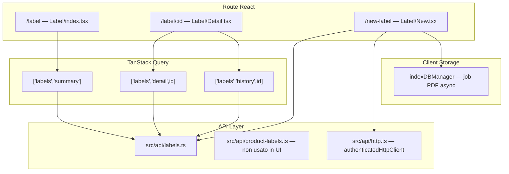
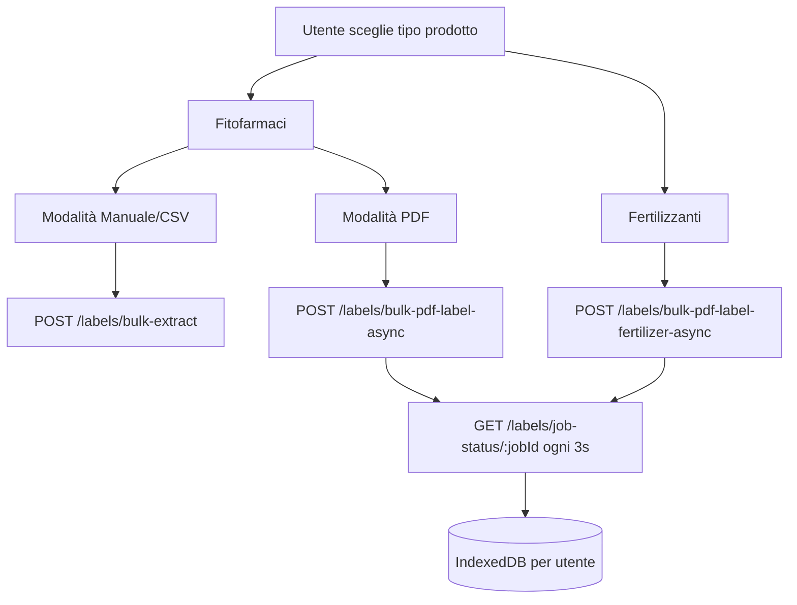
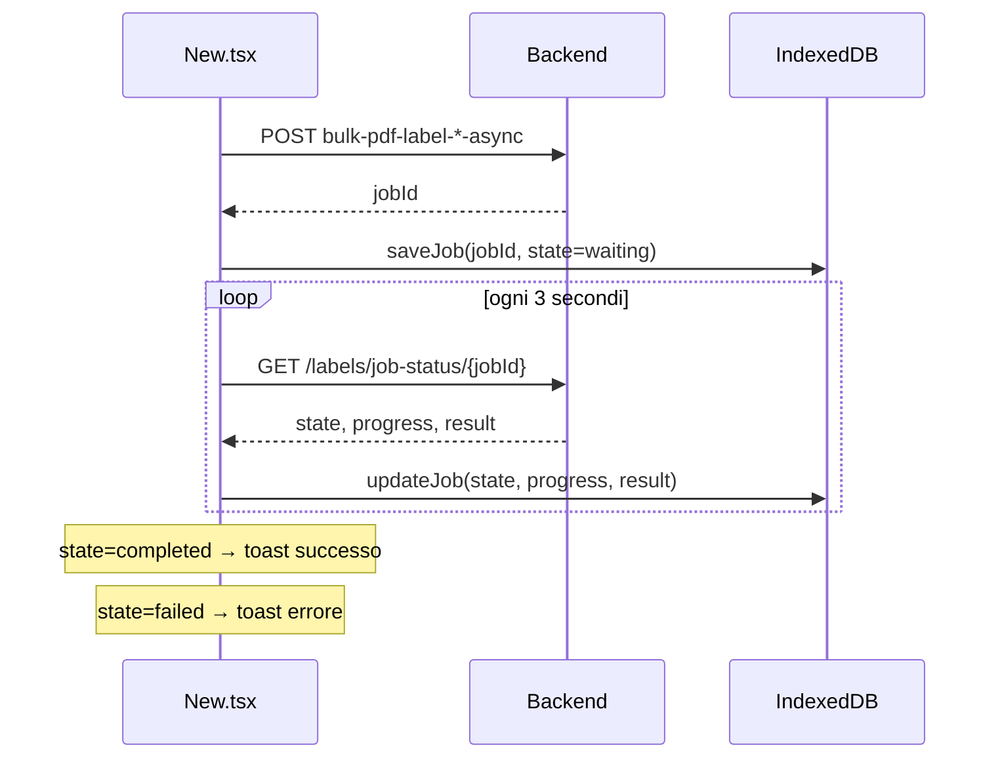
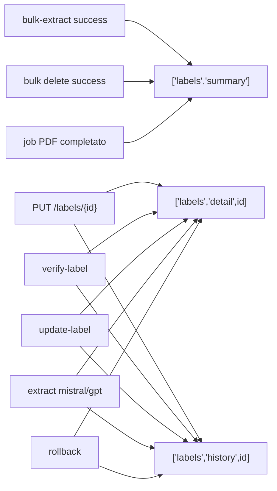

# Documentazione — Sezione Etichette

Riferimento tecnico-funzionale del modulo **Etichette** nel frontend Seminai (`seminai-fe-v2`), basato sul codice in `src/routes/Label/`, `src/api/labels.ts` e hook correlati.

---

## Indice

1. [Panoramica e permessi](#1-panoramica-e-permessi)
2. [Architettura del modulo](#2-architettura-del-modulo)
3. [Lista etichette (`/label`)](#3-lista-etichette-label)
4. [Dettaglio etichetta (`/label/:id`)](#4-dettaglio-etichetta-labelid)
5. [Ricerca e aggiunta nuove etichette (`/new-label`)](#5-ricerca-e-aggiunta-nuove-etichette-new-label)
6. [Riferimento API completo con curl](#6-riferimento-api-completo-con-curl)
7. [TanStack Query — cache e invalidazioni](#7-tanstack-query--cache-e-invalidazioni)
8. [Integrazioni correlate](#8-integrazioni-correlate)
9. [Note e limitazioni attuali](#9-note-e-limitazioni-attuali)

---

## 1. Panoramica e permessi

### Route

| Route        | File                          | Componente        | Descrizione                          |
| ------------ | ----------------------------- | ----------------- | ------------------------------------ |
| `/label`     | `src/routes/Label/index.tsx`  | `Label`           | Lista etichette (+ tab Disciplinari) |
| `/label/:id` | `src/routes/Label/Detail.tsx` | `LabelDetailPage` | Dettaglio singola etichetta          |
| `/new-label` | `src/routes/Label/New.tsx`    | `NewLabel`        | Creazione / estrazione bulk          |

Le route sono definite in `src/App.tsx` e protette da `ProtectedRoute`.

### Ruoli utente

| Ruolo           | Accesso lista     | Modifica dettaglio | Eliminazione | Aggiunta etichette | Rollback cronologia |
| --------------- | ----------------- | ------------------ | ------------ | ------------------ | ------------------- |
| `ADMIN`         | Sì                | Sì                 | Sì           | Sì                 | Sì                  |
| `LABEL_MANAGER` | Sì                | Sì                 | Sì           | Sì                 | No                  |
| `BASIC`         | Sì (sola lettura) | No                 | No           | No                 | No                  |

La variabile `canModify` è `true` solo per `ADMIN` e `LABEL_MANAGER` (in `Label/index.tsx` e `Label/Detail.tsx`).

`LABEL_MANAGER` ha accesso limitato all'app: redirect di default verso `/label` (configurato in `ProtectedRoute`).

### Tab Disciplinari

La pagina `/label` contiene un secondo tab **Disciplinari** con una tabella separata (`disciplinariApiService`). Non fa parte del flusso principale delle etichette prodotto, ma condivide la stessa pagina lista.

---

## 2. Architettura del modulo



### File chiave

| Area                              | File                            |
| --------------------------------- | ------------------------------- |
| API e tipi                        | `src/api/labels.ts`             |
| Lookup prodotto (non usato in UI) | `src/api/product-labels.ts`     |
| HTTP client autenticato           | `src/api/http.ts`               |
| Hook dettaglio / cronologia       | `src/hooks/useLabel.ts`         |
| Hook lista                        | `src/hooks/useLabelsSummary.ts` |
| Pagina lista                      | `src/routes/Label/index.tsx`    |
| Pagina dettaglio                  | `src/routes/Label/Detail.tsx`   |
| Pagina nuova etichetta            | `src/routes/Label/New.tsx`      |
| Job PDF (IndexedDB)               | `src/utils/indexDBManager.ts`   |
| Helper tabella                    | `src/utils/tableHelpers.ts`     |

### Configurazione API

- **Base URL:** variabile d'ambiente `VITE_API_URL`, default `http://localhost:8081`
- **Autenticazione:** tutte le chiamate usano `credentials: "include"` (cookie httpOnly di sessione)
- **`authenticatedHttpClient`** (usato per job PDF e job-status): aggiunge opzionalmente `Authorization: Bearer <token>` se presente in `authService` (necessario in produzione cross-origin)
- Le funzioni fetch dirette in `labels.ts` usano solo cookie, senza header Bearer

---

## 3. Lista etichette (`/label`)

### API chiamata

```
GET /labels/summary
```

Implementata da `labelsApiService.getSummary()` in `src/api/labels.ts`.  
Query key TanStack: `["labels", "summary"]`.

### DTO `LabelSummary`

```typescript
type LabelSummary = {
  id: string;
  productName: string;
  registrationNumber: string;
  extractionConfidence: number;
  qualityExtraction: number[];
  errors: string[];
  isVerified: boolean;
  category?: string; // "FITO" | "PESTICIDE" | "FERTILIZER"
  createdAt: string;
};
```

### Mapping colonne UI

| Campo API              | Colonna UI              | Logica di rendering                                                                          |
| ---------------------- | ----------------------- | -------------------------------------------------------------------------------------------- |
| `productName`          | Nome commerciale        | Testo                                                                                        |
| `registrationNumber`   | Numero di registrazione | Testo                                                                                        |
| `category`             | Categoria               | `FITO`/`PESTICIDE` → badge "Fitosanitario" (blu); `FERTILIZER` → "Fertilizzante" (arancione) |
| `isVerified`           | Verificata              | Badge verde "Verificata" / giallo "Non verificata"                                           |
| `createdAt`            | Data creazione          | `Intl.DateTimeFormat("it-IT")` con data e ora                                                |
| `extractionConfidence` | Qualità estrazione      | `formatConfidence()`: se valore ≤ 1 → percentuale (es. `0.95` → `95%`)                       |

**Campi presenti nel DTO ma non mostrati in lista:** `qualityExtraction`, `errors`.

### Logiche UI

| Comportamento      | Implementazione                                                                                           |
| ------------------ | --------------------------------------------------------------------------------------------------------- |
| Tabella            | `EditableTable` con `isModify={false}`                                                                    |
| Filtri / ricerca   | Built-in di `EditableTable` (`useTableFilters`) — nessun filtro business custom (es. solo non verificate) |
| Click riga         | Navigazione a `/label/{id}`                                                                               |
| Selezione multipla | Stato locale `selectedLabelRows`                                                                          |
| Eliminazione bulk  | `DELETE /labels/bulk` con `{ ids: string[] }` — solo se `canModify`                                       |
| Aggiungi           | Pulsante → `/new-label`                                                                                   |
| Export CSV         | `exportFileName="etichette"`                                                                              |
| **Loading**        | `Spinner` + testo "Caricamento etichette…"                                                                |
| **Errore**         | Testo rosso "Impossibile caricare le etichette."                                                          |
| **Empty**          | "Nessuna etichetta disponibile"                                                                           |

### Esempio risposta API

```json
{
  "status": "success",
  "data": [
    {
      "id": "550e8400-e29b-41d4-a716-446655440000",
      "productName": "REVOLUTION",
      "registrationNumber": "16667",
      "extractionConfidence": 0.95,
      "qualityExtraction": [1, 0, 1],
      "errors": [],
      "isVerified": false,
      "category": "FITO",
      "createdAt": "2025-06-06T10:00:00.000Z"
    }
  ]
}
```

---

## 4. Dettaglio etichetta (`/label/:id`)

### API chiamata

```
GET /labels/{id}
```

Hook: `useLabel({ id })` → query key `["labels", "detail", id]`.

### DTO `LabelDetail`

```typescript
type LabelDetail = {
  id: string;
  productName: string;
  registrationNumber: string;
  sourceUrl: string; // URL PDF etichetta ministeriale
  label: LabelInner; // payload strutturato (fitosanitario o fertilizzante)
  rawText: string; // testo grezzo estratto
  extractionConfidence: number;
  extractedFields: string[];
  errors: string[];
  qualityExtraction: number[];
  isVerified: boolean;
  createdAt: string;
  updatedAt: string;
};
```

### Header e azioni

| Elemento UI           | Azione                                     | API                                                                             |
| --------------------- | ------------------------------------------ | ------------------------------------------------------------------------------- |
| Titolo                | `{productName} - no. {registrationNumber}` | —                                                                               |
| Checkbox "Verificata" | Toggle stato verifica                      | `POST /labels/verify-label/{id}` body `{ "isVerified": true/false }`            |
| Link "Estratto"       | Drawer con `rawText` + re-estrazione AI    | `POST /labels/extract-with-mistral/{id}` o `POST /labels/extract-with-gpt/{id}` |
| Link "Cronologia"     | Drawer storico modifiche (lazy load)       | `GET /labels/{id}/history`                                                      |
| Rollback (solo ADMIN) | Ripristina snapshot precedente             | `POST /labels/rollback/{historyId}`                                             |
| Pulsante "Aggiorna"   | Re-extract from the stored `rawText`       | `POST /labels/update-label/{id}` (empty body)                                   |
| Refresh ministeriale  | Queue a new SIAN source refresh            | `POST /labels/{id}/refresh`                                                     |

### Layout

- **Desktop:** split a 2 colonne — dati a sinistra, PDF (`sourceUrl`) in iframe a destra
- **Mobile:** PDF in accordion collassabile

### Tab "Dettagli"

La UI sceglie automaticamente la variante in base alla presenza di `label.prodotto_fertilizzante_ue`:

```typescript
const isFertilizer = Boolean(detail?.label?.prodotto_fertilizzante_ue);
```

#### Variante Fitosanitario

Campi mostrati in tabella verticale (`buildLabelColumns` / `toLabelRow`):

| Campo `LabelInner`                           | Etichetta UI                               |
| -------------------------------------------- | ------------------------------------------ |
| `prodotto`                                   | Prodotto                                   |
| `categoria`                                  | Categoria                                  |
| `formulazione`                               | Formulazione                               |
| `principio_attivo`                           | Principio attivo                           |
| `composizione`                               | Composizione                               |
| `meccanismo_azione_frac`                     | Meccanismo azione (FRAC)                   |
| `malattie`                                   | Malattie (lista → stringa)                 |
| `specie`                                     | Specie                                     |
| `colture_target`                             | Colture target                             |
| `colture_target_fuori_periodo_di_prodizione` | Colture target fuori periodo di produzione |
| `numero_registrazione`                       | N. registrazione                           |
| `titolare`                                   | Titolare                                   |
| `stabilimento`                               | Stabilimento                               |
| `caratteristiche`                            | Caratteristiche                            |
| `avvertenze`                                 | Avvertenze                                 |
| `frasi_pericolo`                             | Frasi pericolo                             |
| `frasi_prudenza`                             | Frasi prudenza                             |
| `compatibilita`                              | Compatibilità                              |
| `note_tecniche`                              | Note tecniche                              |
| `fitotossicita`                              | Fitotossicità                              |
| `fasce_di_rispetto_e_deriva`                 | Fasce di rispetto e deriva                 |

**Sezione Resistenze** (`label.resistenze[]` — tipo `LabelResistenza`):

| Campo                                             | Descrizione                     |
| ------------------------------------------------- | ------------------------------- |
| `testo_completo`                                  | Testo completo della resistenza |
| `raccomandazioni`                                 | Raccomandazioni                 |
| `n_max_applicazioni` / `n_min_applicazioni`       | Numero applicazioni             |
| `n_max_applicazioni_um` / `n_min_applicazioni_um` | Unità di misura                 |

#### Variante Fertilizzante

Campi da `label.prodotto_fertilizzante_ue` (`buildFertilizerColumns` / `toFertilizerRow`):

**Identificazione prodotto** (`identificazione_prodotto`):

| Campo API                     | Etichetta UI           |
| ----------------------------- | ---------------------- |
| `nome_commerciale`            | Nome Commerciale       |
| `funzione_categoria_prodotto` | Funzione/Categoria     |
| `numero_lotto`                | Numero Lotto           |
| `stato_fisico`                | Stato Fisico           |
| `confezioni_disponibili`      | Confezioni Disponibili |
| `quantita_nominale`           | Quantità Nominale      |

**Composizione garantita** (`composizione_garantita`):

| Sezione            | Campi                                                                     |
| ------------------ | ------------------------------------------------------------------------- |
| NPK                | `N_totale`, `P2O5_totale`, `K2O_totale`                                   |
| Meso elementi      | `CaO_totale`, `MgO_totale`, `SO3_totale`, `Na2O_totale`                   |
| Forme azoto        | Array `forme_azoto` (tipo + percentuale)                                  |
| Solubilità fosforo | `P2O5_solubile_acqua`, `P2O5_solubile_citrato_ammonio_neutro`             |
| Micronutrienti     | Array (elemento + percentuale)                                            |
| Parametri organici | `carbonio_organico_biologico`, `acidi_umici_fulvici`, `sostanza_organica` |

**Istruzioni uso** (`istruzioni_uso_agronomiche`): uso previsto, frequenza, condizioni stoccaggio.

**Sicurezza CLP** (`informazioni_sicurezza_clp`): avvertenza, pittogrammi, frasi H, frasi P, note mediche.

### Tab "Dosaggi"

#### Fitosanitario — `label.dosaggi_dettagliati[]`

Ogni dosaggio è mostrato in accordion (`LabelDosaggioDettagliato`):

| Campo                                          | Etichetta UI                  |
| ---------------------------------------------- | ----------------------------- |
| `coltura`                                      | Coltura                       |
| `malattia`                                     | Malattia                      |
| `dose_minima` / `dose_massima`                 | Dose min/max                  |
| `dose_um`                                      | Unità di misura dose          |
| `acqua_max` / `acqua_max_um`                   | Acqua max                     |
| `n_max_applicazioni` / `n_max_applicazioni_um` | N. applicazioni               |
| `intervallo_min_giorni`                        | Intervallo min (giorni)       |
| `intervallo_sicurezza_giorni`                  | Intervallo sicurezza (giorni) |
| `epoca_impiego`                                | Epoca impiego                 |
| `modalita_applicazione`                        | Modalità applicazione         |
| `istruzioni`                                   | Istruzioni                    |

#### Fertilizzante — `specifiche_coltura[]`

Path: `prodotto_fertilizzante_ue.istruzioni_uso_agronomiche.dosi_applicazione.specifiche_coltura`

| Campo                               | Etichetta UI       |
| ----------------------------------- | ------------------ |
| `coltura`                           | Coltura            |
| `fase_fenologica`                   | Fase fenologica    |
| `dose_kg_ha`                        | Dose kg/ha         |
| `dose_kg_ha_min` / `dose_kg_ha_max` | Dose min/max kg/ha |

### Vista JSON e salvataggio

- Toggle **Vista tabella** / **Vista JSON**: textarea editabile con il payload completo
- Salvataggio → `PUT /labels/{id}` con `UpdateLabelPayload` (campi parziali)
- **Dirty state:** i pulsanti Salva/Annulla su dosaggi, resistenze e dosaggi fertilizzante si abilitano confrontando `JSON.stringify` dello stato locale vs. stato originale

### Cronologia (`LabelHistoryEntry`)

Caricata lazy quando il drawer "Cronologia" è aperto (`useLabelHistory`, `enabled` condizionale).

| Campo                   | Descrizione                                                |
| ----------------------- | ---------------------------------------------------------- |
| `id`                    | ID entry storico                                           |
| `labelExtractionId`     | ID etichetta                                               |
| `userId` / `userName`   | Utente che ha modificato                                   |
| `userProfilePictureUrl` | Avatar                                                     |
| `changes[]`             | Array `LabelFieldChange` (`field`, `oldValue`, `newValue`) |
| `previousSnapshot`      | Snapshot completo precedente                               |
| `createdAt`             | Data modifica                                              |

### Stati UI dettaglio

| Stato             | Comportamento                                          |
| ----------------- | ------------------------------------------------------ |
| **Loading**       | `Spinner` + "Caricamento dettaglio…"                   |
| **Errore**        | "Impossibile caricare il dettaglio."                   |
| **Salvataggio**   | Toast "Dati salvati" + invalidate `detail` e `history` |
| **Verifica**      | Toast "Stato verifica aggiornato"                      |
| **Aggiorna**      | Toast "Etichetta aggiornata con successo"              |
| **Estrazione AI** | Toast successo/errore per Mistral o GPT                |

---

## 5. Ricerca e aggiunta nuove etichette (`/new-label`)

Pagina: `src/routes/Label/New.tsx` — route `/new-label`.



### Selezione tipo prodotto

| Tipo          | Valore stato                    | Modalità disponibili                       |
| ------------- | ------------------------------- | ------------------------------------------ |
| Fitofarmaci   | `labelType === "fitofarmaci"`   | Manuale/CSV **oppure** PDF                 |
| Fertilizzanti | `labelType === "fertilizzanti"` | **Solo PDF** (toggle manuale disabilitato) |

Alla selezione "Fertilizzanti", un `useEffect` forza `uploadMode` a `"pdf"`.

### Fitofarmaci — modalità Manuale / CSV

**Stato locale:** array di righe `{ id, name, regNumber }` + `concurrency` (1–10, default 5).

| Funzionalità          | Dettaglio                                                                               |
| --------------------- | --------------------------------------------------------------------------------------- |
| Form manuale          | Aggiungi/rimuovi righe con nome prodotto e numero registrazione                         |
| Import CSV            | Colonne obbligatorie: `nome prodotto`, `numero registrazione` (header case-insensitive) |
| Validazione duplicati | Stesso `regNumber` in più righe → evidenziazione rossa client-side                      |
| Submit                | `POST /labels/bulk-extract`                                                             |

**Request body:**

```json
{
  "items": [{ "name": "REVOLUTION", "regNumber": "16667" }],
  "concurrency": 5
}
```

**Flusso post-submit:**

1. Toast: `Elaborazione completata: {successful}/{processed} successi, {failed} falliti`
2. Invalidate `["labels", "summary"]`
3. Redirect a `/label`

**Nota importante:** non esiste autocomplete sul registro fitosanitario in questa pagina. L'utente inserisce manualmente nome e numero registrazione; il **backend** cerca ed estrae l'etichetta dalla fonte ministeriale.

### Fitofarmaci — modalità PDF

| Funzionalità       | Dettaglio                                                         |
| ------------------ | ----------------------------------------------------------------- |
| Upload             | Multiplo, drag & drop, solo `application/pdf`                     |
| Validazione client | Tipo MIME PDF (limite pagine validato server-side, max ~6 pagine) |
| Submit             | `POST /labels/bulk-pdf-label-async` (multipart)                   |
| Concurrency        | Campo form `concurrency` (1–10)                                   |

**Multipart form fields:**

- `files`: uno o più file PDF
- `concurrency`: stringa numerica

**Risposta:**

```json
{
  "status": "success",
  "data": { "jobId": "uuid-del-job" }
}
```

### Fertilizzanti — solo PDF

Stessa UX upload PDF, endpoint diverso:

```
POST /labels/bulk-pdf-label-fertilizer-async
```

Stessa shape multipart (`files[]`, `concurrency`). I dati estratti usano la struttura `prodotto_fertilizzante_ue` anziché `dosaggi_dettagliati` fitosanitario.

### Job asincrono PDF (fitofarmaci e fertilizzanti)



**IndexedDB** (`indexDBManager`):

- Database scoped per utente: `SeminaiLabelJobs_{userId}`
- Fallback a `localStorage` se IndexedDB non disponibile
- Job salvati con: `id`, `createdAt`, `updatedAt`, `state`, `progress`, `fileNames`, `concurrency`, `result`, `error`

**Stati job:**

| Stato API   | Label UI        |
| ----------- | --------------- |
| `waiting`   | In attesa       |
| `active`    | In elaborazione |
| `completed` | Completato      |
| `failed`    | Fallito         |

**Risultato job** (`LabelExtractionResult` per file):

| Campo       | Descrizione                       |
| ----------- | --------------------------------- |
| `fileName`  | Nome file PDF                     |
| `status`    | `"extracted"` o `"failed"`        |
| `name`      | Nome prodotto estratto            |
| `regNumber` | Numero registrazione estratto     |
| `bucketUrl` | URL storage PDF                   |
| `label`     | Dati strutturati estratti         |
| `labelId`   | ID etichetta creata (se successo) |
| `error`     | Messaggio errore (se fallito)     |

**Storico operazioni:** toggle "Storico operazioni" mostra tabella job con colonne Job ID, File, Stato, Progresso, Data creazione, Data completamento, Risultati. Al completamento, pulsante per aprire `/label/{labelId}` in nuova tab.

---

## 6. Riferimento API completo con curl

### Setup

```bash
export BASE_URL="http://localhost:8081"
export COOKIE="session=YOUR_SESSION_COOKIE"
# Opzionale (per endpoint che usano authenticatedHttpClient):
export TOKEN="YOUR_JWT_TOKEN"
```

Tutte le chiamate includono `--cookie "$COOKIE"`. Dove indicato, aggiungere anche `-H "Authorization: Bearer $TOKEN"`.

---

### 1. Lista etichette

|                 |                                                                 |
| --------------- | --------------------------------------------------------------- |
| **Endpoint**    | `GET /labels/summary`                                           |
| **File FE**     | `src/api/labels.ts` → `getLabelsSummary()`                      |
| **Chiamato da** | `Label/index.tsx`, `useLabelsSummary`, `Dashboard`, `Job/index` |

```bash
curl "$BASE_URL/labels/summary" \
  -H "Accept: application/json" \
  --cookie "$COOKIE"
```

---

### 2. Dettaglio etichetta

|                 |                                                  |
| --------------- | ------------------------------------------------ |
| **Endpoint**    | `GET /labels/{id}`                               |
| **File FE**     | `src/api/labels.ts` → `getLabelById()`           |
| **Chiamato da** | `useLabel` → `Label/Detail.tsx`, `Job/index.tsx` |

```bash
curl "$BASE_URL/labels/LABEL_UUID" \
  -H "Accept: application/json" \
  --cookie "$COOKIE"
```

---

### 3. Estrazione bulk fitofarmaci (manuale/CSV)

|                 |                                             |
| --------------- | ------------------------------------------- |
| **Endpoint**    | `POST /labels/bulk-extract`                 |
| **File FE**     | `src/api/labels.ts` → `bulkExtractLabels()` |
| **Chiamato da** | `Label/New.tsx` (modalità manuale)          |

```bash
curl -X POST "$BASE_URL/labels/bulk-extract" \
  -H "Content-Type: application/json" \
  -H "Accept: application/json" \
  --cookie "$COOKIE" \
  -d '{
    "items": [
      { "name": "REVOLUTION", "regNumber": "16667" }
    ],
    "concurrency": 5
  }'
```

**Risposta:**

```json
{
  "status": "success",
  "data": {
    "processed": 1,
    "successful": 1,
    "failed": 0,
    "results": [
      /* LabelSummary[] */
    ]
  }
}
```

---

### 4. Estrazione PDF fitofarmaci (async)

|                 |                                                               |
| --------------- | ------------------------------------------------------------- |
| **Endpoint**    | `POST /labels/bulk-pdf-label-async`                           |
| **File FE**     | `Label/New.tsx` → `pdfMutation` via `authenticatedHttpClient` |
| **Chiamato da** | `Label/New.tsx` (modalità PDF, fitofarmaci)                   |

```bash
curl -X POST "$BASE_URL/labels/bulk-pdf-label-async" \
  -H "Accept: application/json" \
  -H "Authorization: Bearer $TOKEN" \
  --cookie "$COOKIE" \
  -F "files=@/path/to/etichetta.pdf" \
  -F "files=@/path/to/etichetta2.pdf" \
  -F "concurrency=5"
```

**Risposta:**

```json
{
  "status": "success",
  "data": { "jobId": "uuid-del-job" }
}
```

---

### 5. Estrazione PDF fertilizzanti (async)

|                 |                                                                         |
| --------------- | ----------------------------------------------------------------------- |
| **Endpoint**    | `POST /labels/bulk-pdf-label-fertilizer-async`                          |
| **File FE**     | `Label/New.tsx` → `fertilizerPdfMutation` via `authenticatedHttpClient` |
| **Chiamato da** | `Label/New.tsx` (tipo fertilizzanti)                                    |

```bash
curl -X POST "$BASE_URL/labels/bulk-pdf-label-fertilizer-async" \
  -H "Accept: application/json" \
  -H "Authorization: Bearer $TOKEN" \
  --cookie "$COOKIE" \
  -F "files=@/path/to/fertilizzante.pdf" \
  -F "concurrency=5"
```

---

### 6. Stato job PDF

|                 |                                                                   |
| --------------- | ----------------------------------------------------------------- |
| **Endpoint**    | `GET /labels/job-status/{jobId}`                                  |
| **File FE**     | `Label/New.tsx` → `pollJobStatus()` via `authenticatedHttpClient` |
| **Chiamato da** | Polling ogni 3s fino a `completed`/`failed`                       |

```bash
curl "$BASE_URL/labels/job-status/JOB_UUID" \
  -H "Accept: application/json" \
  -H "Authorization: Bearer $TOKEN" \
  --cookie "$COOKIE"
```

**Risposta (shape usata dal frontend):**

```json
{
  "status": "success",
  "data": {
    "state": "active",
    "progress": 50,
    "result": {
      "results": [
        {
          "fileName": "etichetta.pdf",
          "status": "extracted",
          "name": "PRODOTTO X",
          "regNumber": "12345",
          "bucketUrl": "https://...",
          "label": { "prodotto": "PRODOTTO X", "categoria": "..." },
          "labelId": "uuid-etichetta",
          "error": null
        }
      ],
      "cost": {}
    }
  }
}
```

---

### 7. Eliminazione bulk

|                 |                                            |
| --------------- | ------------------------------------------ |
| **Endpoint**    | `DELETE /labels/bulk`                      |
| **File FE**     | `src/api/labels.ts` → `bulkDeleteLabels()` |
| **Chiamato da** | `Label/index.tsx` (selezione multipla)     |

```bash
curl -X DELETE "$BASE_URL/labels/bulk" \
  -H "Content-Type: application/json" \
  -H "Accept: application/json" \
  --cookie "$COOKIE" \
  -d '{ "ids": ["uuid-1", "uuid-2"] }'
```

**Risposta:**

```json
{
  "status": "success",
  "message": "Labels deleted",
  "deleted_count": 2
}
```

---

### 8. Aggiornamento etichetta

|                 |                                                  |
| --------------- | ------------------------------------------------ |
| **Endpoint**    | `PUT /labels/{id}`                               |
| **File FE**     | `src/api/labels.ts` → `updateLabel()`            |
| **Chiamato da** | `useLabel` → `saveAsync()` in `Label/Detail.tsx` |

```bash
curl -X PUT "$BASE_URL/labels/LABEL_UUID" \
  -H "Content-Type: application/json" \
  -H "Accept: application/json" \
  --cookie "$COOKIE" \
  -d '{
    "productName": "REVOLUTION",
    "registrationNumber": "16667",
    "label": {
      "prodotto": "REVOLUTION",
      "dosaggi_dettagliati": [
        {
          "coltura": "Vite",
          "malattia": "Peronospora",
          "dose_minima": 100,
          "dose_massima": 150,
          "dose_um": "ml/hl"
        }
      ]
    }
  }'
```

Tutti i campi di `UpdateLabelPayload` sono opzionali (update parziale).

---

### 9. Verifica etichetta

|                 |                                             |
| --------------- | ------------------------------------------- |
| **Endpoint**    | `POST /labels/verify-label/{id}`            |
| **File FE**     | `src/api/labels.ts` → `verifyLabel()`       |
| **Chiamato da** | Checkbox "Verificata" in `Label/Detail.tsx` |

```bash
curl -X POST "$BASE_URL/labels/verify-label/LABEL_UUID" \
  -H "Content-Type: application/json" \
  -H "Accept: application/json" \
  --cookie "$COOKIE" \
  -d '{ "isVerified": true }'
```

---

### 10. Re-extract from stored raw text

|                 |                                                            |
| --------------- | ---------------------------------------------------------- |
| **Endpoint**    | `POST /labels/update-label/{id}`                           |
| **File FE**     | `src/api/labels.ts` → `updateLabelOverwrite()`             |
| **Chiamato da** | Pulsante "Aggiorna" in `Label/Detail.tsx` (`confirmAsync`) |

```bash
curl -X POST "$BASE_URL/labels/update-label/LABEL_UUID" \
  -H "Accept: application/json" \
  --cookie "$COOKIE"
```

Empty body. This endpoint does not fetch SIAN again: it re-runs structured
extraction on the `rawText` already stored in `LabelExtraction`.

### 10 bis. Queue ministerial source refresh

|              |                                              |
| ------------ | -------------------------------------------- |
| **Endpoint** | `POST /labels/{id}/refresh`                  |
| **Access**   | `ADMIN` or `LABEL_MANAGER`                   |
| **Behavior** | Queues `LabelRefreshQueue` with `mode="ids"` |

```bash
curl -X POST "$BASE_URL/labels/LABEL_UUID/refresh" \
  -H "Accept: application/json" \
  --cookie "$COOKIE"
```

The async worker fetches the current SIAN PDF, compares PDF/text hashes,
re-extracts only when content changed, writes system history, and updates
product label summaries.

Internal cron endpoint:

```http
POST /internal/labels/refresh
Header: X-Cron-Secret: <LABEL_REFRESH_CRON_SECRET>
Body: { "mode": "stale", "limit": 50, "dryRun": false }
```

Cloud Scheduler setup:

```bash
PROJECT_ID="<project-id>" \
LABEL_REFRESH_CRON_SECRET="<strong-secret>" \
scripts/gcloud/create-label-refresh-scheduler.sh
```

---

### 11. Re-estrazione con Mistral

|                 |                                              |
| --------------- | -------------------------------------------- |
| **Endpoint**    | `POST /labels/extract-with-mistral/{id}`     |
| **File FE**     | `src/api/labels.ts` → `extractWithMistral()` |
| **Chiamato da** | Drawer "Estratto" in `Label/Detail.tsx`      |

```bash
curl -X POST "$BASE_URL/labels/extract-with-mistral/LABEL_UUID" \
  -H "Accept: application/json" \
  --cookie "$COOKIE"
```

---

### 12. Re-estrazione con GPT

|                 |                                          |
| --------------- | ---------------------------------------- |
| **Endpoint**    | `POST /labels/extract-with-gpt/{id}`     |
| **File FE**     | `src/api/labels.ts` → `extractWithGpt()` |
| **Chiamato da** | Drawer "Estratto" in `Label/Detail.tsx`  |

```bash
curl -X POST "$BASE_URL/labels/extract-with-gpt/LABEL_UUID" \
  -H "Content-Type: application/json" \
  -H "Accept: application/json" \
  --cookie "$COOKIE"
```

---

### 13. Cronologia modifiche

|                 |                                                    |
| --------------- | -------------------------------------------------- |
| **Endpoint**    | `GET /labels/{labelExtractionId}/history`          |
| **File FE**     | `src/api/labels.ts` → `getLabelHistory()`          |
| **Chiamato da** | `useLabelHistory` (drawer "Cronologia", lazy load) |

```bash
curl "$BASE_URL/labels/LABEL_UUID/history" \
  -H "Accept: application/json" \
  --cookie "$COOKIE"
```

**Risposta:**

```json
{
  "status": "success",
  "data": [
    {
      "id": "history-uuid",
      "labelExtractionId": "label-uuid",
      "userId": "user-uuid",
      "userName": "Mario Rossi",
      "userProfilePictureUrl": null,
      "changes": [{ "field": "label.dosaggi_dettagliati", "oldValue": [], "newValue": [{}] }],
      "previousSnapshot": {},
      "createdAt": "2025-06-06T12:00:00.000Z"
    }
  ]
}
```

---

### 14. Rollback cronologia

|                 |                                                        |
| --------------- | ------------------------------------------------------ |
| **Endpoint**    | `POST /labels/rollback/{historyId}`                    |
| **File FE**     | `src/api/labels.ts` → `rollbackLabel()`                |
| **Chiamato da** | Drawer "Cronologia" in `Label/Detail.tsx` (solo ADMIN) |

```bash
curl -X POST "$BASE_URL/labels/rollback/HISTORY_UUID" \
  -H "Accept: application/json" \
  --cookie "$COOKIE"
```

---

### 15. Lookup etichetta per prodotto (non usato in UI)

|              |                                                                        |
| ------------ | ---------------------------------------------------------------------- |
| **Endpoint** | `GET /labels/by-product?name=…&regNumber=…`                            |
| **File FE**  | `src/api/product-labels.ts` → `productLabelsApiService.getByProduct()` |
| **Stato**    | API definita ma **non collegata a nessuna pagina** del frontend        |

```bash
curl -G "$BASE_URL/labels/by-product" \
  --data-urlencode "name=REVOLUTION" \
  --data-urlencode "regNumber=16667" \
  -H "Accept: application/json" \
  -H "Authorization: Bearer $TOKEN" \
  --cookie "$COOKIE"
```

404 → il client restituisce `{ status: "success", data: null }`.

---

### Riepilogo endpoint

| #   | Endpoint                                  | Metodo | Client HTTP                           |
| --- | ----------------------------------------- | ------ | ------------------------------------- |
| 1   | `/labels/summary`                         | GET    | `fetch` + cookie                      |
| 2   | `/labels/{id}`                            | GET    | `fetch` + cookie                      |
| 3   | `/labels/bulk-extract`                    | POST   | `fetch` + cookie                      |
| 4   | `/labels/bulk-pdf-label-async`            | POST   | `authenticatedHttpClient`             |
| 5   | `/labels/bulk-pdf-label-fertilizer-async` | POST   | `authenticatedHttpClient`             |
| 6   | `/labels/job-status/{jobId}`              | GET    | `authenticatedHttpClient`             |
| 7   | `/labels/bulk`                            | DELETE | `fetch` + cookie                      |
| 8   | `/labels/{id}`                            | PUT    | `fetch` + cookie                      |
| 9   | `/labels/verify-label/{id}`               | POST   | `fetch` + cookie                      |
| 10  | `/labels/update-label/{id}`               | POST   | `fetch` + cookie                      |
| 11  | `/labels/{id}/refresh`                    | POST   | `fetch` + cookie                      |
| 12  | `/internal/labels/refresh`                | POST   | Cloud Scheduler + `X-Cron-Secret`     |
| 13  | `/labels/extract-with-mistral/{id}`       | POST   | `fetch` + cookie                      |
| 14  | `/labels/extract-with-gpt/{id}`           | POST   | `fetch` + cookie                      |
| 15  | `/labels/{id}/history`                    | GET    | `fetch` + cookie                      |
| 16  | `/labels/rollback/{historyId}`            | POST   | `fetch` + cookie                      |
| 17  | `/labels/by-product`                      | GET    | `authenticatedHttpClient` (non usato) |

---

## 7. TanStack Query — cache e invalidazioni

### Query keys

| Query key                                  | Hook / pagina                         | API sottostante            |
| ------------------------------------------ | ------------------------------------- | -------------------------- |
| `["labels", "summary"]`                    | `useLabelsSummary`, `Label/index.tsx` | `GET /labels/summary`      |
| `["labels", "detail", id]`                 | `useLabel`                            | `GET /labels/{id}`         |
| `["labels", "history", labelExtractionId]` | `useLabelHistory`                     | `GET /labels/{id}/history` |

### Invalidazioni



| Azione                                            | Query invalidate                                        |
| ------------------------------------------------- | ------------------------------------------------------- |
| `bulk-extract` (manuale)                          | `["labels", "summary"]`                                 |
| `bulk delete`                                     | `["labels", "summary"]`                                 |
| Job PDF completato                                | `["labels", "summary"]`                                 |
| `saveAsync` (PUT)                                 | `["labels", "detail", id]`, `["labels", "history", id]` |
| `verifyAsync`                                     | `["labels", "detail", id]`, `["labels", "history", id]` |
| `confirmAsync` (Aggiorna)                         | `["labels", "detail", id]`, `["labels", "history", id]` |
| `extractWithMistralAsync` / `extractWithGptAsync` | `["labels", "detail", id]`, `["labels", "history", id]` |
| `rollbackAsync`                                   | `["labels", "detail", id]`, `["labels", "history", id]` |

La cronologia usa `enabled: Boolean(labelExtractionId) && enabled` — viene caricata solo quando il drawer è aperto.

---

## 8. Integrazioni correlate

### Job view (`src/routes/Job/index.tsx`)

- Usa `useLabelsSummary()` per ottenere l'elenco etichette
- Match client-side tra operazioni e etichette per `productName` / `registrationNumber`
- Apre un sheet laterale read-only (`LabelDetailSheet`) con ricerca testuale sui campi
- Riutilizza `useLabel` per caricare il dettaglio completo

### Dosage Agent Chat (`src/routes/DosageAgentChat/constants.ts`)

- Tool backend `search_product_label_database` ("Ricerca etichette prodotto")
- Nessun endpoint frontend dedicato — è un tool dell'agente lato server

### Dataset locale fitosanitari (`src/services/fitosanitariRegistry.ts`)

- Carica `/datasets/fitosanitari/fts_06062025.json` (dataset statico)
- Usato in DosageManager, Job, NewOperation per cercare prodotti fitosanitari autorizzati
- **Non** usato per estrazione etichette né nella pagina `/new-label`

---

## 9. Note e limitazioni attuali

| Nota                      | Dettaglio                                                                                                         |
| ------------------------- | ----------------------------------------------------------------------------------------------------------------- |
| `productLabelsApiService` | `GET /labels/by-product` definito ma non collegato a nessuna UI                                                   |
| `LabelJobsTable`          | Organism in `src/components/organism/LabelJobsTable.tsx` esiste ma `New.tsx` reimplementa la stessa logica inline |
| Route disciplinari        | Click su riga disciplinario naviga a `/disciplinari/:id` ma la route non è definita in `App.tsx`                  |
| `Detail.tsx`              | File > 2000 righe — candidato a split in componenti/hook dedicati                                                 |
| Filtri lista              | Solo filtri generici `EditableTable`, nessun filtro business (es. solo non verificate, per categoria)             |
| Autocomplete registro     | Assente in `/new-label` — l'utente deve conoscere nome e numero registrazione                                     |
| Limite PDF                | Validazione pagine (~6 max) solo server-side                                                                      |

---
