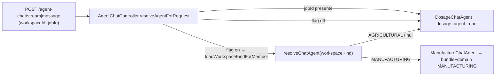

# Manufacture ReAct Agent — Architettura e tool

Documentazione operativa dell'agente conversazionale per **workspace manifatturieri** (`workspace.kind = MANUFACTURING`).
A differenza dell'agente agricolo, **non c'è una cartella `react_manufacture_agent/` separata**: l'agente
manifatturiero **riusa lo stesso grafo LangGraph** di `dosage_agent_react` e ne cambia solo (1) il set di tool
(tool bundle `MANUFACTURING`) e (2) il prompt (discriminatore `domain`), esposti tramite un adapter dedicato e
il seam di routing. Questa scelta rispetta il principio "minimal duplication" della roadmap (§1.3).

Ambito: magazzino, prodotti/giacenze, anagrafica aziende e importazione documenti (DDT/fatture). **Nessuna
funzione agronomica** (dosaggi, trattamenti, campi, unità produttive, note di campo, BDF, meteo, vendite).

## Indice

1. [Ruolo e dominio](#1-ruolo-e-dominio)
2. [Architettura: riuso del grafo dosage](#2-architettura-riuso-del-grafo-dosage)
3. [Routing e punti di ingresso](#3-routing-e-punti-di-ingresso)
4. [Tool bundle MANUFACTURING](#4-tool-bundle-manufacturing)
5. [Prompt (discriminatore `domain`)](#5-prompt-discriminatore-domain)
6. [Autorizzazione e CompanyKind](#6-autorizzazione-e-companykind)
7. [Test](#7-test)
8. [Riferimenti file chiave](#8-riferimenti-file-chiave)

---

## 1. Ruolo e dominio

Assistente operativo manifatturiero: risponde su magazzino/giacenze, anagrafica aziende e lettura/import di
documenti commerciali (DDT, fatture fornitore). Declina gli argomenti agronomici. La perimetrazione dati
rispecchia l'archivio manifatturiero di `ListFileExtractionsUseCase` (per `CompanyKind.MANUFACTURING`: solo
`company` + `products`/magazzino; esclusi `fields`, `production_units`, `job_group`).

---

## 2. Architettura: riuso del grafo dosage

L'agente manifatturiero **non introduce un nuovo grafo**. Riusa integralmente:

- `DosageReactGraphFactory` (`graph/DosageReactGraph.ts`) — nodi, routing, HITL, loop detection;
- `streaming.ts` — streaming SSE (token, tool, costi, crediti);
- checkpointer (`graph/checkpointer-factory.ts`), model router (`shared/modelRouter.ts`), cache per `threadId`.

Per tutti questi aspetti **vale la documentazione dosage**: vedi
[DOSAGE_REACT_AGENT_ARCHITETTURA.md](./DOSAGE_REACT_AGENT_ARCHITETTURA.md) (§3 Grafo, §4 Stato/checkpoint, §5
Sicurezza/HITL, §6 Wrapping tool). Le **uniche** differenze rispetto all'agente agricolo:

| Aspetto     | Agricolo (`DOSAGE`/`FULL`)             | Manifatturiero (`MANUFACTURING`)                                 |
| ----------- | -------------------------------------- | ---------------------------------------------------------------- |
| Tool        | pipeline dosi + tutto il catalogo      | allowlist di 9 tool (§4)                                         |
| Prompt      | `domain: 'DOSAGE'` (persona agronomo)  | `domain: 'MANUFACTURING'` (persona magazzino/documenti)          |
| Flag prompt | `hasPlanning/hasProductLabelDb/…` true | gli stessi flag agronomici a `false` (gating `!isManufacturing`) |
| Adapter     | `DosageChatAgent`                      | `ManufactureChatAgent`                                           |
| CompanyKind | nessun filtro                          | `companyKindFilter = MANUFACTURING` su listing + guard su import |

Il percorso agricolo resta **byte-identico** (i nuovi rami sono guard positivi `=== 'MANUFACTURING'`).

---

## 3. Routing e punti di ingresso

`AgentChatController` non istanzia direttamente le funzioni dell'agente: risolve un `ChatAgentPort` in base al
kind del workspace.

| Elemento                 | File                                                   | Ruolo                                                                                                                                      |
| ------------------------ | ------------------------------------------------------ | ------------------------------------------------------------------------------------------------------------------------------------------ |
| `ChatAgentPort`          | `services/agents/chat-routing/ChatAgentPort.ts`        | Contratto: `kind`, `stream`, `createApp`, `getCachedApp`, `handleUserMessage`, `approve`, `reject`, `getState`.                            |
| `DosageChatAgent`        | `services/agents/chat-routing/DosageChatAgent.ts`      | Adapter agricolo: delega 1:1 alle funzioni `dosage_agent_react`.                                                                           |
| `ManufactureChatAgent`   | `services/agents/chat-routing/ManufactureChatAgent.ts` | Adapter manifatturiero: forza `{ toolBundle: 'MANUFACTURING', domain: 'MANUFACTURING' }` su `createApp`/`stream`; il resto delega 1:1.     |
| `resolveChatAgent`       | `services/agents/chat-routing/resolveChatAgent.ts`     | Registry `Partial<Record<WorkspaceKind, ChatAgentPort>>`; `null`/kind non registrato → fallback dosage (con warn).                         |
| `resolveAgentForRequest` | `http/controllers/AgentChatController.ts`              | `jobId` → forza agricolo; flag off → agricolo (membership opzionale); flag on → `workspaceId` obbligatorio + `loadWorkspaceKindForMember`. |

**Feature flag `WORKSPACE_KIND_ROUTING`** (`process.env`, default off): quando `true` il routing per kind è
attivo e `workspaceId` è obbligatorio (`400 WORKSPACE_ID_REQUIRED` se assente); quando off la chat usa sempre
l'agente dosage (legacy). `approve`/`reject`/`getState` operano su un thread esistente e restano sull'agente
dosage in Phase 3/4.

---

## 4. Tool bundle MANUFACTURING

Definito in `graph/tool-registry.ts`. Le categorie `CONTEXT_DISCOVERY`, `ENTITY_MANAGEMENT`, `STOCK` mescolano
tool ammessi e agronomici, quindi il bundle applica una **allowlist per nome** (`MANUFACTURING_TOOL_ALLOWLIST`)
sopra il filtro per categoria, attiva **solo** quando `bundle === 'MANUFACTURING'` (i percorsi `DOSAGE`/`FULL`
restano invariati).

| Tool                            | Scopo                                                                      |
| ------------------------------- | -------------------------------------------------------------------------- |
| `list_user_companies`           | Elenca le aziende dell'utente (filtrate per kind, vedi §6).                |
| `list_company_products`         | Prodotti a magazzino con giacenze (salva `inputProducts`).                 |
| `search_company_stock_products` | Ricerca prodotti/giacenze per nome o categoria.                            |
| `get_working_memory_details`    | Lettura strutturata della working memory.                                  |
| `ask_user_questions`            | Questionario strutturato.                                                  |
| `extract_from_file`             | Estrazione dati da file caricato (anteprima, no scrittura).                |
| `present_extraction_review`     | Form editabile per documenti (DDT/Fattura); read-only.                     |
| `import_stock_from_file`        | Import giacenze da CSV/Excel. **Richiede approvazione** + guard kind (§6). |
| `check_extraction_status`       | Stato di un'estrazione in corso.                                           |

**Esclusi** (assenti dal bundle, verificato da test): `import_from_file` (campi/UP), `list_production_units`,
`normalize_extraction`, `check_product_crop_authorizations`, `schedule_alert`, `create_company`, e tutte le
categorie agronomiche (`DOSAGE_PIPELINE`, `PLANNING`, `CONFORMITY`, `JOB_MANAGEMENT`, `FIELD_NOTES`,
`WORKSPACE_RULES`, `WEATHER`, `SALES`, `SEARCH`/BDF/disciplinari), `start_dosage_agent_job`, `spawn_subagent`.

---

## 5. Prompt (discriminatore `domain`)

`SystemPromptOptions.domain: 'DOSAGE' | 'MANUFACTURING'` (default `DOSAGE`) seleziona la persona e i blocchi.
`buildSystemPrompt`/`buildAgentsPrompt`/`buildToolsPrompt` (`prompt/system-prompt.ts`,
`prompt/agents-prompt.builder.ts`, `prompt/tools-prompt.builder.ts`) fanno **early-return** verso le varianti
manifatturiere quando `domain === 'MANUFACTURING'`, lasciando il percorso dosage immutato:

| File                                            | Contenuto                                                                              |
| ----------------------------------------------- | -------------------------------------------------------------------------------------- |
| `prompt/manufacturing-soul-prompt.constant.ts`  | Persona magazzino/documenti; mantiene la REGOLA #1 lingua; niente agronomia.           |
| `prompt/manufacturing-agents-prompt.builder.ts` | Workflow: scoperta contesto, import documenti, regole di approvazione, working memory. |
| `prompt/manufacturing-tools-prompt.builder.ts`  | Guida d'uso dei 9 tool del bundle.                                                     |

`graph/DosageReactGraph.ts` passa `domain` e imposta i flag agronomici hard-coded come `!isManufacturing`
(`hasPlanning`, `hasProductLabelDb`, `hasPhotoDiagnosis`, `hasJobModification`). Il `domain` è incluso anche
nella cache equality (`agent-cache-config.ts`) per evitare riuso cross-dominio sullo stesso `threadId`.

---

## 6. Autorizzazione e CompanyKind

Enforcement minimale per impedire a una chat manifatturiera di vedere/scrivere aziende agricole:

- `ToolRegistryConfig.companyKindFilter` viene impostato a `CompanyKind.MANUFACTURING` dal grafo quando
  `domain === 'MANUFACTURING'` e passato a `createListUserCompaniesTool(userId, kindFilter)`: `list_user_companies`
  filtra le aziende per kind (`tools/list-user-companies.tool.ts`).
- `import_stock_from_file` (`tools/import-stock-from-file.tool.ts`) verifica l'appartenenza dell'azienda e,
  se `kindFilter` è impostato, rifiuta company di kind diverso (guard difensivo sul percorso di scrittura).

Tutti i tool restano scoped per `userId` come nell'agente dosage. **Deferiti** (follow-up): filtro per kind
anche su `list_company_products`/`search_company_stock_products` con `companyId` esplicito, e un
`create_company` manifatturiero.

---

## 7. Test

| Tipo                  | File                                                                      | Copertura                                                                                                  |
| --------------------- | ------------------------------------------------------------------------- | ---------------------------------------------------------------------------------------------------------- |
| Unit — bundle         | `dosage_agent_react/__tests__/tool-registry-bundle.test.ts`               | Il bundle `MANUFACTURING` espone esattamente i 9 tool, nessuno escluso; flag agronomici off.               |
| Unit — prompt         | `dosage_agent_react/prompt/__tests__/manufacturing-system-prompt.test.ts` | Persona manifatturiera, niente guida agronomica; prompt dosage byte-identico (snapshot).                   |
| Integration — routing | `integration-test/agent-chat-controller.integration.test.ts`              | Flag on + workspace MANUFACTURING → `ManufactureChatAgent`; missing `workspaceId` → 400; `jobId` → dosage. |
| Integration — smoke   | `integration-test/manufacture-react-agent.integration.test.ts`            | Stream real-LLM: completa senza errori e **non chiama mai** un tool agronomico.                            |

I test di integrazione richiedono l'infra su (`docker compose up -d redis qdrant mongodb`).

---

## 8. Riferimenti file chiave

| File                                                        | Contenuto                                                 |
| ----------------------------------------------------------- | --------------------------------------------------------- |
| `services/agents/chat-routing/ChatAgentPort.ts`             | Contratto comune degli agenti di chat.                    |
| `services/agents/chat-routing/ManufactureChatAgent.ts`      | Adapter manifatturiero (forza bundle + domain).           |
| `services/agents/chat-routing/resolveChatAgent.ts`          | Registry di routing per workspace kind.                   |
| `services/agents/dosage_agent_react/graph/tool-registry.ts` | Bundle `MANUFACTURING` + allowlist + `companyKindFilter`. |
| `services/agents/dosage_agent_react/prompt/manufacturing-*` | Persona e guida tool manifatturiere.                      |
| `http/controllers/AgentChatController.ts`                   | `resolveAgentForRequest` / `loadWorkspaceKindForMember`.  |

Per il grafo, lo streaming, l'HITL e la cache (condivisi) vedi
[DOSAGE_REACT_AGENT_ARCHITETTURA.md](./DOSAGE_REACT_AGENT_ARCHITETTURA.md); per l'integrazione frontend e il
campo `workspaceId` vedi [dosage-react-agent-frontend-integration.md](./dosage-react-agent-frontend-integration.md).
