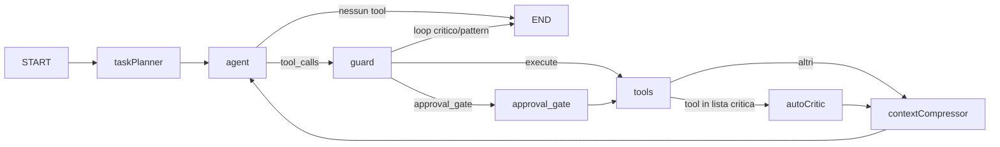

# Dosage ReAct Agent — Architettura e tool — Part 1

[Back to the guide index](../DOSAGE_REACT_AGENT_ARCHITETTURA.md)

Documentazione operativa del modulo `src/infrastructure/services/agents/dosage_agent_react/`: agente conversazionale per agronomi che combina ragionamento LLM (ReAct), grafo LangGraph, memoria di lavoro per sessione e integrazione con tool di calcolo dosi, ricerca normativa e gestione dati aziendali.

## Indice

1. [Ruolo e pattern ReAct](#1-ruolo-e-pattern-react)
2. [Punti di ingresso API](#2-punti-di-ingresso-api)
3. [Grafo LangGraph](#3-grafo-langgraph)
4. [Stato, checkpoint e memoria](#4-stato-checkpoint-e-memoria)
5. [Sicurezza: approvazioni, rischio, loop](#5-sicurezza-approvazioni-rischio-loop)
6. [Avvolgimenti comuni sui tool](#6-avvolgimenti-comuni-sui-tool)
7. [Moduli collaterali](#7-moduli-collaterali)
8. [Catalogo tool (per nome)](#8-catalogo-tool-per-nome)
9. [Tool non registrati nel grafo](#9-tool-non-registrati-nel-grafo)

---

## 1. Ruolo e pattern ReAct

L’agente implementa il ciclo **Reason → Act → Observe**:

1. **Reason**: il nodo `agent` invoca il modello con messaggi di sistema (prompt costruito da `prompt/system-prompt.ts` e builder correlati) e tool bindati.
2. **Act**: se il modello emette `tool_calls`, il flusso passa da `guard` a `tools` (eventualmente dopo `approval_gate`).
3. **Observe**: i risultati tornano come `ToolMessage`; il grafo può passare da `autoCritic` e/o `contextCompressor` prima di un nuovo turno dell’`agent`.

I tool leggono e scrivono risultati intermedi nella **working memory** (mappa in-process indicizzata per `threadId`, vedi `working-memory.ts` e tipo `WorkingMemory` in `type/state.ts`), così da concatenare passaggi (es. `search_products` → `calculate_dosage` → `validate_compliance`).

---

## 2. Punti di ingresso API

| Esportazione (`index.ts` / `DosageReactAgent.ts`)                                     | Scopo                                                                                                                                                                              |
| ------------------------------------------------------------------------------------- | ---------------------------------------------------------------------------------------------------------------------------------------------------------------------------------- |
| `createReactAgent`                                                                    | Costruisce o riusa (cache) l’`AgentApp` compilato: RAG job opzionale, vector store PDF disciplinari, repository Prisma, caricamento memorie utente, ripristino stato thread da DB. |
| `handleUserMessage`                                                                   | Esegue un turno completo consumando lo stream del grafo; se l’ultimo messaggio AI ha ancora `tool_calls` in attesa di approvazione, restituisce `REQUIRES_APPROVAL`.               |
| `approveAction` / `rejectAction`                                                      | Human-in-the-loop: approva e riprende, oppure rifiuta (preferenza: `forkBeforeGuard` per time-travel, altrimenti `hitlReject`).                                                    |
| `streamReactAgent` (`streaming.ts`)                                                   | Stesso grafo con eventi stream (token, tool, costi, crediti).                                                                                                                      |
| `getAgentState`, `resetThread`, `getThreadHistory`, `forkBeforeGuard`                 | Ispezione stato, reset memoria/cache, storico checkpoint, fork da rifiuto.                                                                                                         |
| Cache: `getCachedAgentApp`, `cacheAgentApp`, `evictAgentApp`, `stopAgentCacheCleanup` | Riuso istanze per `threadId` con TTL e limite massimo entry.                                                                                                                       |

La factory del grafo è `DosageReactGraphFactory` in `graph/DosageReactGraph.ts`.

> **Routing per workspace kind.** `AgentChatController` non chiama più direttamente queste funzioni: risolve
> l'agente di chat tramite `resolveChatAgent({ workspaceKind })` (`services/agents/chat-routing/`). I workspace
> `AGRICULTURAL` (e il workspace di default) usano **questo** agente (`dosage_agent_react`, via `DosageChatAgent`);
> i workspace `MANUFACTURING` instradano a `react_manufacture_agent` (vedi
> [MANUFACTURE_REACT_AGENT_ARCHITETTURA.md](./MANUFACTURE_REACT_AGENT_ARCHITETTURA.md)). Il routing è gated dal
> flag `WORKSPACE_KIND_ROUTING` (quando `true`, `workspaceId` è obbligatorio → `400 WORKSPACE_ID_REQUIRED` se
> assente); la presenza di `jobId` forza comunque l'agente dosage. La chat job-scoped resta quindi sempre agricola.

---

## 3. Grafo LangGraph

Struttura dichiarata (semplificata):

### Nodi

| Nodo                | File                           | Funzione                                                                                                                                                                                                                               |
| ------------------- | ------------------------------ | -------------------------------------------------------------------------------------------------------------------------------------------------------------------------------------------------------------------------------------- |
| `taskPlanner`       | `graph/task-planner-node.ts`   | All’avvio carica i task persistiti (`plan_task` / DB) e inietta un `SystemMessage` di promemoria (`formatTaskReminder`).                                                                                                               |
| `agent`             | `graph/nodes.ts`               | Chiama il modello; aggiunge regola post-esecuzione per evitare richiami nello stesso turno degli stessi tool già riusciti; aggiorna `pendingAction` con classificazione rischio (`risk-classifier.ts`); log usage LLM in task durable. |
| `guard`             | `graph/nodes.ts`               | Aggiorna `lastToolCalls` e `loopCounter`; il **routing** effettivo è in `graph/routing.ts` (`createRouteAfterGuard`).                                                                                                                  |
| `approval_gate`     | `graph/nodes.ts`               | Nodo vuoto: con `requireApproval: true` il grafo usa `interruptBefore: ['approval_gate']` così l’esecuzione si ferma **prima** del nodo finché l’utente non approva.                                                                   |
| `tools`             | LangGraph `ToolNode`           | Esegue il tool richiesto (uno per ciclo effettivo del modello, in base alle `tool_calls`).                                                                                                                                             |
| `autoCritic`        | `graph/auto-critic-node.ts`    | Per un sottoinsieme di tool “pesanti”, controlla anomalie (es. dosi/ha fuori range) e può iniettare avvisi.                                                                                                                            |
| `contextCompressor` | `memory/context-compressor.ts` | Se il contesto supera soglie, riassume messaggi centrali e può salvare riassunto in memoria episodica (`AgentMemoryService`).                                                                                                          |

### Routing

- **`routeAfterAgent`**: se l’ultimo messaggio ha `tool_calls` → `guard`, altrimenti `END`.
- **`createRouteAfterGuard`**: se `LoopDetector` segnala `critical` o `pattern` → `END`; se almeno una `tool_call` richiede approvazione umana secondo `classifyRisk` / `shouldAutoApprove` → `approval_gate`; altrimenti → `tools` (`execute`).
- **`routeAfterTools`**: se l’ultimo `ToolMessage.name` è in `CRITIC_TARGET_TOOLS` → `autoCritic`, altrimenti direttamente `contextCompressor`.

---

## 4. Stato, checkpoint e memoria

### Stato grafo (`graph/graph-state.ts` → `DosageReactAnnotation`)

Campi principali: `messages`, `currentTask`, `pendingAction`, `sources`, `loopCounter`, `lastToolCalls`, `taskList`.

### Working memory (per `threadId`)

Struttura ricca documentata in `type/state.ts`: esiti di matching prodotti, dosaggi, compliance, piano attivo, questionari pendenti, deleghe field note, file caricati, esiti conformità, cache etichette, ecc. I tool la aggiornano tramite `updateWorkingMemory` / `getWorkingMemory`.

### Checkpoint

`createDosageReactCheckpointer` (`graph/checkpointer-factory.ts`) persiste i checkpoint LangGraph; `persistence/thread-state-recovery.ts` ripristina lo stato del thread da DB all’avvio; `persistence/thread-history.service.ts` espone storico per time-travel / debug.

---

## 5. Sicurezza: approvazioni, rischio, loop

### Approvazione (HITL)

- Con `requireApproval` attivo (default), i tool ad alto rischio non eseguono subito: il grafo si interrompe prima di `approval_gate`.
- `approveAction` delega a `hitlApprove` con `dosageRiskPolicy` per **auto-continue** su azioni a basso rischio e emitter socket per progressi.
- `rejectAction` tenta `forkBeforeGuard` (`graph/fork-at-rejection.ts`) per tornare a un checkpoint precedente al guard; in fallback usa `hitlReject`.

### Classificazione rischio

`graph/risk-classifier.ts`: punteggi base per tool sensibili, aggiustamenti per operazioni massive (`jobIds` / `selectedJobIds`) e flag `overwrite` / `replacePdfFromChat`. Solo classificazione `low` ottiene `shouldAutoApprove === true`.

> Nota: `DESTRUCTIVE_TOOLS` in `tools/create-jobs.tool.ts` è marcato **deprecated** a favore della politica basata su `classifyRisk`.

### Loop detector

`loop-detector.ts` usa soglie da `graph/runtime-limits.constant.ts` per warning, abort su troppi tool call o pattern ripetuti nella finestra recente.

### Post-regola nel nodo agent

Dopo ogni messaggio umano, l’agente vede quali tool sono già stati eseguiti con successo nello stesso turno e riceve istruzioni esplicite di **non richiamarli**.

---

## 6. Avvolgimenti comuni sui tool

In `graph/tool-registry.ts`, ogni `StructuredTool` viene avvolto **dal centro verso l’esterno** così:

1. **`wrapToolWithDurableTask`** (`graph/durable-execution.ts`): usa `task()` di LangGraph per rendere idempotente / ripetibile la porzione side-effect del tool dove applicabile.
2. **`wrapToolWithArgumentValidator`** (`tools/argument-validator.ts`): validazione argomenti.
3. **`wrapToolWithRetry`** (`tools/retry-wrapper.ts`): tentativi in caso di errori transitori.
4. **`wrapToolWithReminder`** (`tools/tool-result-wrapper.ts`): arricchisce il risultato con istruzioni per il modello sul passo successivo.

---

## 7. Moduli collaterali

| Area                       | Path                                                         | Ruolo                                                                                                    |
| -------------------------- | ------------------------------------------------------------ | -------------------------------------------------------------------------------------------------------- |
| Prompt                     | `prompt/`                                                    | System prompt, builder agenti/tool, priorità ricerca, costanti “soul”.                                   |
| Search tools               | `search-tools/`                                              | Re-export Tavily, rules, DB disciplinari, PDF BDF, client BDF, vector store operazioni job.              |
| Socket                     | `socket/`                                                    | Emissione eventi chat / stanze utente per approvazioni e follow-up.                                      |
| Outer loop                 | `outer-loop/outer-loop.service.ts`                           | Trigger proattivi in DB (`OuterLoopTrigger`); il tool `schedule_alert` ne è il collegamento lato agente. |
| Menzioni / contesto utente | `mention-*.ts`, `user-message-context-builder.ts`            | Risoluzione @mention e contesto aggiuntivo per il messaggio.                                             |
| Agent coordination         | `services/agent-coordination.ts`, `resource-lock.service.ts` | Coordinamento e lock tra sessioni dove necessario.                                                       |
| Test                       | `__tests__/`, `*.test.ts`                                    | Copertura unitaria/integration.                                                                          |

---

## 8. Catalogo tool (per nome)

I tool effettivamente registrati dipendono da **config** passata a `buildTools` (userId, jobId, workspaceId, chiavi API, env BDF, vector store, repository, `DosageAgentContext`, `chatId`).

Legenda condizioni:

- **Sempre**: registrati senza `userId`.
- **Con `userId`**: contesto utente e tool di discovery/onboarding.
- **Con `context.userId`**: conformità.
- **Con `userId` + `userInfo` + `jobRepository` + `stockRepository`**: job management.
- **Con `jobId` o `workspaceId` o `userId`**: `search_rules`.
- **Env BDF** (`URL_SERVER_BDF`, `USERNAME_BDF`, `PASSWORD_BDF`): tool BDF.
- **Con `tavilyApiKey`**: ricerca scientifica.
- **Con vector store PDF**: `search_disciplinari_bdf_pdf`.
- **Con RAG operazioni job popolato**: `search_job_operations`.
- **Con `chatId`**: anche `plan_task` oltre agli altri tool di planning.

### Pipeline dosi e conformità (sempre, categoria `DOSAGE_PIPELINE`)

| Nome tool                       | Scopo sintetico                                                                     |
| ------------------------------- | ----------------------------------------------------------------------------------- |
| `check_product_revoked`         | Verifica se prodotti risultano revocati/non utilizzabili.                           |
| `expand_production_cycles`      | Espande cicli colturali sulle unità di produzione in memoria.                       |
| `extract_buffer_zones`          | Estrae fasce rispetto da confini / corsi d’acqua in base ai dati in working memory. |
| `enrich_from_bdf`               | Arricchimento dati prodotto da integrazione BDF.                                    |
| `search_products`               | Matching prodotti-colture sulle unità (scrive `matchedProducts` in WM).             |
| `calculate_dosage`              | Calcolo dosi e date trattamento (scrive `dosageResults`).                           |
| `validate_compliance`           | Controllo regole / violazioni disciplinari.                                         |
| `validate_sa_group_limits`      | Limiti gruppi SA.                                                                   |
| `check_compatibility`           | Compatibilità tra prodotti/trattamenti.                                             |
| `plan_treatment_strategy`       | Strategia incrociata tra prodotti.                                                  |
| `calculate_stock_balance`       | Bilanciamento stock rispetto ai trattamenti calcolati.                              |
| `optimize_dosage`               | Ottimizzazione dosi secondo criteri configurati.                                    |
| `create_treatment_jobs`         | **Persistenza job** nel DB; tipicamente richiede approvazione e dati da WM.         |
| `search_product_label_database` | Ricerca su DB etichette registrate.                                                 |

### Planning

| Nome tool                  | Scopo                                                            |
| -------------------------- | ---------------------------------------------------------------- |
| `generate_treatment_plan`  | Genera piano strutturato (`activePlan` in WM).                   |
| `modify_plan_step`         | Modifica passo del piano.                                        |
| `execute_treatment_plan`   | Esegue piano (side-effect; target di auto-critic).               |
| `plan_task`                | Todo persistito per chat (richiede `chatId`).                    |
| `list_existing_job_groups` | Elenco gruppi job esistenti (richiede `userId`).                 |
| `start_dosage_agent_job`   | Avvio pipeline “completa” dosage agent asincrona (alto rischio). |

### Discovery contesto e interazione (con `userId`)

| Nome tool                    | Scopo                                                       |
| ---------------------------- | ----------------------------------------------------------- |
| `get_working_memory_details` | Lettura strutturata WM per il modello.                      |
| `list_user_companies`        | Aziende dell’utente.                                        |
| `list_production_units`      | Unità di produzione per contesto.                           |
| `list_company_products`      | Prodotti in anagrafica aziendale.                           |
| `schedule_alert`             | Pianifica alert (outer loop / trigger DB).                  |
| `ask_user_questions`         | Presenta questionario strutturato (`pendingQuestionnaire`). |

### Field note (con `userId`)

| Nome tool                | Scopo                                                      |
| ------------------------ | ---------------------------------------------------------- |
| `delegate_to_field_note` | Delega sotto-dialogo all’agent field note (istanza in WM). |
| `approve_field_note`     | Conferma esito delega.                                     |
| `reject_field_note`      | Rifiuta / annulla flusso delega.                           |

### Creazione entità e import (con `userId`)

| Nome tool                 | Scopo                                           |
| ------------------------- | ----------------------------------------------- |
| `create_company`          | Crea azienda.                                   |
| `create_fields`           | Crea campi.                                     |
| `create_production_units` | Crea unità di produzione.                       |
| `update_production_units` | Aggiorna unità.                                 |
| `list_user_fields`        | Lista campi utente (cache in WM).               |
| `extract_from_file`       | Estrazione dati da file (shapefile, CSV, ecc.). |
| `import_from_file`        | Import massivo da dati estratti.                |
| `import_stock_from_file`  | Import giacenze da file magazzino/fattura.      |
| `check_extraction_status` | Stato job estrazione asincrona (BullMQ).        |

### Regole workspace (con `userId`)

| Nome tool                | Scopo                            |
| ------------------------ | -------------------------------- |
| `list_user_workspaces`   | Workspace accessibili.           |
| `list_workspace_rules`   | Regole del workspace.            |
| `create_workspace_rule`  | Crea regola (può allegare file). |
| `update_workspace_rule`  | Aggiorna regola.                 |
| `archive_workspace_rule` | Archivia regola.                 |

### Conformità (con `DosageAgentContext.userId`)

| Nome tool                  | Scopo                                      |
| -------------------------- | ------------------------------------------ |
| `run_conformity_check`     | Esegue check conformità (risultato in WM). |
| `confirm_conformity_check` | Conferma/applica esito conformità.         |

### Job management (repository + `userInfo` + `userId`)
