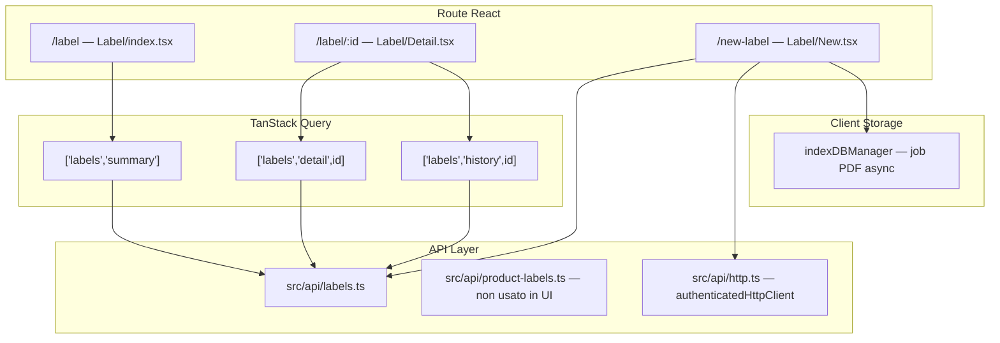

# Documentazione — Sezione Etichette — Part 1

[Back to the guide index](../LABEL_DOCS.md)


Riferimento tecnico-funzionale del modulo **Etichette** nel frontend Seminai (`seminai-fe-v2`), basato sul codice in `src/routes/Label/`, `src/api/labels.ts` e hook correlati.

---

## Indice

1. [Panoramica e permessi](#1-panoramica-e-permessi)
2. [Architettura del modulo](#2-architettura-del-modulo)
3. [Lista etichette (`/label`)](#3-lista-etichette-label)
4. [Dettaglio etichetta (`/label/:id`)](#4-dettaglio-etichetta-labelid)
5. [Ricerca e aggiunta nuove etichette (`/new-label`)](#5-ricerca-e-aggiunta-nuove-etichette-new-label)
6. [Riferimento API completo con curl](#6-riferimento-api-completo-con-curl)
7. [TanStack Query — cache e invalidazioni](#7-tanstack-query--cache-e-invalidazioni)
8. [Integrazioni correlate](#8-integrazioni-correlate)
9. [Note e limitazioni attuali](#9-note-e-limitazioni-attuali)

---

## 1. Panoramica e permessi

### Route

| Route        | File                          | Componente        | Descrizione                          |
| ------------ | ----------------------------- | ----------------- | ------------------------------------ |
| `/label`     | `src/routes/Label/index.tsx`  | `Label`           | Lista etichette (+ tab Disciplinari) |
| `/label/:id` | `src/routes/Label/Detail.tsx` | `LabelDetailPage` | Dettaglio singola etichetta          |
| `/new-label` | `src/routes/Label/New.tsx`    | `NewLabel`        | Creazione / estrazione bulk          |

Le route sono definite in `src/App.tsx` e protette da `ProtectedRoute`.

### Ruoli utente

| Ruolo           | Accesso lista     | Modifica dettaglio | Eliminazione | Aggiunta etichette | Rollback cronologia |
| --------------- | ----------------- | ------------------ | ------------ | ------------------ | ------------------- |
| `ADMIN`         | Sì                | Sì                 | Sì           | Sì                 | Sì                  |
| `LABEL_MANAGER` | Sì                | Sì                 | Sì           | Sì                 | No                  |
| `BASIC`         | Sì (sola lettura) | No                 | No           | No                 | No                  |

La variabile `canModify` è `true` solo per `ADMIN` e `LABEL_MANAGER` (in `Label/index.tsx` e `Label/Detail.tsx`).

`LABEL_MANAGER` ha accesso limitato all'app: redirect di default verso `/label` (configurato in `ProtectedRoute`).

### Tab Disciplinari

La pagina `/label` contiene un secondo tab **Disciplinari** con una tabella separata (`disciplinariApiService`). Non fa parte del flusso principale delle etichette prodotto, ma condivide la stessa pagina lista.

---

## 2. Architettura del modulo



### File chiave

| Area                              | File                            |
| --------------------------------- | ------------------------------- |
| API e tipi                        | `src/api/labels.ts`             |
| Lookup prodotto (non usato in UI) | `src/api/product-labels.ts`     |
| HTTP client autenticato           | `src/api/http.ts`               |
| Hook dettaglio / cronologia       | `src/hooks/useLabel.ts`         |
| Hook lista                        | `src/hooks/useLabelsSummary.ts` |
| Pagina lista                      | `src/routes/Label/index.tsx`    |
| Pagina dettaglio                  | `src/routes/Label/Detail.tsx`   |
| Pagina nuova etichetta            | `src/routes/Label/New.tsx`      |
| Job PDF (IndexedDB)               | `src/utils/indexDBManager.ts`   |
| Helper tabella                    | `src/utils/tableHelpers.ts`     |

### Configurazione API

- **Base URL:** variabile d'ambiente `VITE_API_URL`, default `http://localhost:8081`
- **Autenticazione:** tutte le chiamate usano `credentials: "include"` (cookie httpOnly di sessione)
- **`authenticatedHttpClient`** (usato per job PDF e job-status): aggiunge opzionalmente `Authorization: Bearer <token>` se presente in `authService` (necessario in produzione cross-origin)
- Le funzioni fetch dirette in `labels.ts` usano solo cookie, senza header Bearer

---

## 3. Lista etichette (`/label`)

### API chiamata

```
GET /labels/summary
```

Implementata da `labelsApiService.getSummary()` in `src/api/labels.ts`.
Query key TanStack: `["labels", "summary"]`.

### DTO `LabelSummary`

```typescript
type LabelSummary = {
  id: string;
  productName: string;
  registrationNumber: string;
  extractionConfidence: number;
  qualityExtraction: number[];
  errors: string[];
  isVerified: boolean;
  category?: string; // "FITO" | "PESTICIDE" | "FERTILIZER"
  createdAt: string;
};
```

### Mapping colonne UI

| Campo API              | Colonna UI              | Logica di rendering                                                                          |
| ---------------------- | ----------------------- | -------------------------------------------------------------------------------------------- |
| `productName`          | Nome commerciale        | Testo                                                                                        |
| `registrationNumber`   | Numero di registrazione | Testo                                                                                        |
| `category`             | Categoria               | `FITO`/`PESTICIDE` → badge "Fitosanitario" (blu); `FERTILIZER` → "Fertilizzante" (arancione) |
| `isVerified`           | Verificata              | Badge verde "Verificata" / giallo "Non verificata"                                           |
| `createdAt`            | Data creazione          | `Intl.DateTimeFormat("it-IT")` con data e ora                                                |
| `extractionConfidence` | Qualità estrazione      | `formatConfidence()`: se valore ≤ 1 → percentuale (es. `0.95` → `95%`)                       |

**Campi presenti nel DTO ma non mostrati in lista:** `qualityExtraction`, `errors`.

### Logiche UI

| Comportamento      | Implementazione                                                                                           |
| ------------------ | --------------------------------------------------------------------------------------------------------- |
| Tabella            | `EditableTable` con `isModify={false}`                                                                    |
| Filtri / ricerca   | Built-in di `EditableTable` (`useTableFilters`) — nessun filtro business custom (es. solo non verificate) |
| Click riga         | Navigazione a `/label/{id}`                                                                               |
| Selezione multipla | Stato locale `selectedLabelRows`                                                                          |
| Eliminazione bulk  | `DELETE /labels/bulk` con `{ ids: string[] }` — solo se `canModify`                                       |
| Aggiungi           | Pulsante → `/new-label`                                                                                   |
| Export CSV         | `exportFileName="etichette"`                                                                              |
| **Loading**        | `Spinner` + testo "Caricamento etichette…"                                                                |
| **Errore**         | Testo rosso "Impossibile caricare le etichette."                                                          |
| **Empty**          | "Nessuna etichetta disponibile"                                                                           |

### Esempio risposta API

```json
{
  "status": "success",
  "data": [
    {
      "id": "550e8400-e29b-41d4-a716-446655440000",
      "productName": "REVOLUTION",
      "registrationNumber": "16667",
      "extractionConfidence": 0.95,
      "qualityExtraction": [1, 0, 1],
      "errors": [],
      "isVerified": false,
      "category": "FITO",
      "createdAt": "2025-06-06T10:00:00.000Z"
    }
  ]
}
```

---

## 4. Dettaglio etichetta (`/label/:id`)

### API chiamata

```
GET /labels/{id}
```

Hook: `useLabel({ id })` → query key `["labels", "detail", id]`.

### DTO `LabelDetail`

```typescript
type LabelDetail = {
  id: string;
  productName: string;
  registrationNumber: string;
  sourceUrl: string; // URL PDF etichetta ministeriale
  label: LabelInner; // payload strutturato (fitosanitario o fertilizzante)
  rawText: string; // testo grezzo estratto
  extractionConfidence: number;
  extractedFields: string[];
  errors: string[];
  qualityExtraction: number[];
  isVerified: boolean;
  createdAt: string;
  updatedAt: string;
};
```

### Header e azioni

| Elemento UI           | Azione                                     | API                                                                             |
| --------------------- | ------------------------------------------ | ------------------------------------------------------------------------------- |
| Titolo                | `{productName} - no. {registrationNumber}` | —                                                                               |
| Checkbox "Verificata" | Toggle stato verifica                      | `POST /labels/verify-label/{id}` body `{ "isVerified": true/false }`            |
| Link "Estratto"       | Drawer con `rawText` + re-estrazione AI    | `POST /labels/extract-with-mistral/{id}` o `POST /labels/extract-with-gpt/{id}` |
| Link "Cronologia"     | Drawer storico modifiche (lazy load)       | `GET /labels/{id}/history`                                                      |
| Rollback (solo ADMIN) | Ripristina snapshot precedente             | `POST /labels/rollback/{historyId}`                                             |
| Pulsante "Aggiorna"   | Re-extract from the stored `rawText`       | `POST /labels/update-label/{id}` (empty body)                                   |
| Refresh ministeriale  | Queue a new SIAN source refresh            | `POST /labels/{id}/refresh`                                                     |

### Layout

- **Desktop:** split a 2 colonne — dati a sinistra, PDF (`sourceUrl`) in iframe a destra
- **Mobile:** PDF in accordion collassabile

### Tab "Dettagli"

La UI sceglie automaticamente la variante in base alla presenza di `label.prodotto_fertilizzante_ue`:

```typescript
const isFertilizer = Boolean(detail?.label?.prodotto_fertilizzante_ue);
```

#### Variante Fitosanitario

Campi mostrati in tabella verticale (`buildLabelColumns` / `toLabelRow`):
