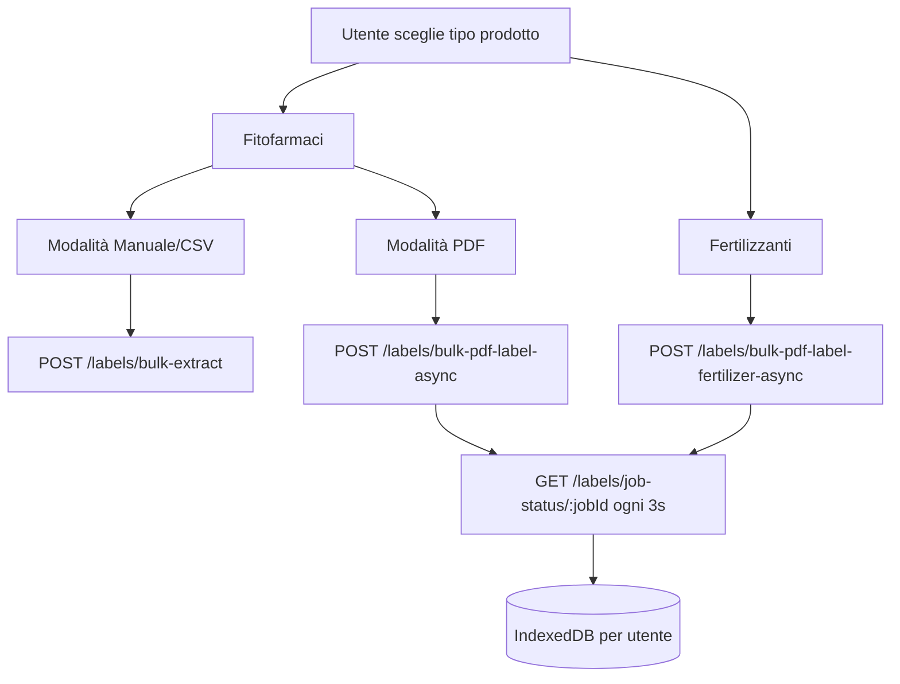
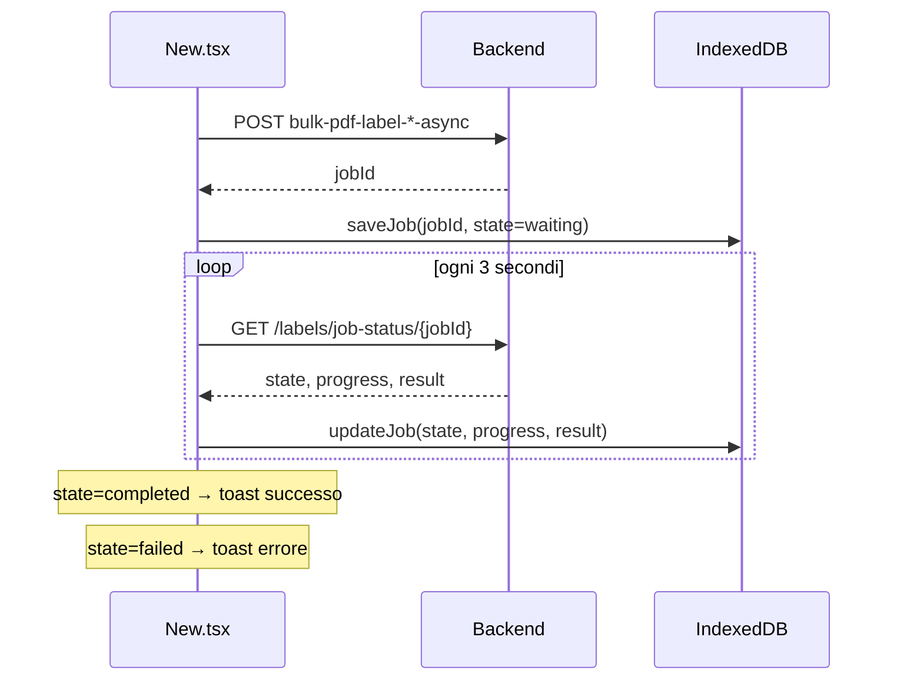

# Documentazione — Sezione Etichette — Part 2

[Back to the guide index](../LABEL_DOCS.md)

| Campo `LabelInner`                           | Etichetta UI                               |
| -------------------------------------------- | ------------------------------------------ |
| `prodotto`                                   | Prodotto                                   |
| `categoria`                                  | Categoria                                  |
| `formulazione`                               | Formulazione                               |
| `principio_attivo`                           | Principio attivo                           |
| `composizione`                               | Composizione                               |
| `meccanismo_azione_frac`                     | Meccanismo azione (FRAC)                   |
| `malattie`                                   | Malattie (lista → stringa)                 |
| `specie`                                     | Specie                                     |
| `colture_target`                             | Colture target                             |
| `colture_target_fuori_periodo_di_prodizione` | Colture target fuori periodo di produzione |
| `numero_registrazione`                       | N. registrazione                           |
| `titolare`                                   | Titolare                                   |
| `stabilimento`                               | Stabilimento                               |
| `caratteristiche`                            | Caratteristiche                            |
| `avvertenze`                                 | Avvertenze                                 |
| `frasi_pericolo`                             | Frasi pericolo                             |
| `frasi_prudenza`                             | Frasi prudenza                             |
| `compatibilita`                              | Compatibilità                              |
| `note_tecniche`                              | Note tecniche                              |
| `fitotossicita`                              | Fitotossicità                              |
| `fasce_di_rispetto_e_deriva`                 | Fasce di rispetto e deriva                 |

**Sezione Resistenze** (`label.resistenze[]` — tipo `LabelResistenza`):

| Campo                                             | Descrizione                     |
| ------------------------------------------------- | ------------------------------- |
| `testo_completo`                                  | Testo completo della resistenza |
| `raccomandazioni`                                 | Raccomandazioni                 |
| `n_max_applicazioni` / `n_min_applicazioni`       | Numero applicazioni             |
| `n_max_applicazioni_um` / `n_min_applicazioni_um` | Unità di misura                 |

#### Variante Fertilizzante

Campi da `label.prodotto_fertilizzante_ue` (`buildFertilizerColumns` / `toFertilizerRow`):

**Identificazione prodotto** (`identificazione_prodotto`):

| Campo API                     | Etichetta UI           |
| ----------------------------- | ---------------------- |
| `nome_commerciale`            | Nome Commerciale       |
| `funzione_categoria_prodotto` | Funzione/Categoria     |
| `numero_lotto`                | Numero Lotto           |
| `stato_fisico`                | Stato Fisico           |
| `confezioni_disponibili`      | Confezioni Disponibili |
| `quantita_nominale`           | Quantità Nominale      |

**Composizione garantita** (`composizione_garantita`):

| Sezione            | Campi                                                                     |
| ------------------ | ------------------------------------------------------------------------- |
| NPK                | `N_totale`, `P2O5_totale`, `K2O_totale`                                   |
| Meso elementi      | `CaO_totale`, `MgO_totale`, `SO3_totale`, `Na2O_totale`                   |
| Forme azoto        | Array `forme_azoto` (tipo + percentuale)                                  |
| Solubilità fosforo | `P2O5_solubile_acqua`, `P2O5_solubile_citrato_ammonio_neutro`             |
| Micronutrienti     | Array (elemento + percentuale)                                            |
| Parametri organici | `carbonio_organico_biologico`, `acidi_umici_fulvici`, `sostanza_organica` |

**Istruzioni uso** (`istruzioni_uso_agronomiche`): uso previsto, frequenza, condizioni stoccaggio.

**Sicurezza CLP** (`informazioni_sicurezza_clp`): avvertenza, pittogrammi, frasi H, frasi P, note mediche.

### Tab "Dosaggi"

#### Fitosanitario — `label.dosaggi_dettagliati[]`

Ogni dosaggio è mostrato in accordion (`LabelDosaggioDettagliato`):

| Campo                                          | Etichetta UI                  |
| ---------------------------------------------- | ----------------------------- |
| `coltura`                                      | Coltura                       |
| `malattia`                                     | Malattia                      |
| `dose_minima` / `dose_massima`                 | Dose min/max                  |
| `dose_um`                                      | Unità di misura dose          |
| `acqua_max` / `acqua_max_um`                   | Acqua max                     |
| `n_max_applicazioni` / `n_max_applicazioni_um` | N. applicazioni               |
| `intervallo_min_giorni`                        | Intervallo min (giorni)       |
| `intervallo_sicurezza_giorni`                  | Intervallo sicurezza (giorni) |
| `epoca_impiego`                                | Epoca impiego                 |
| `modalita_applicazione`                        | Modalità applicazione         |
| `istruzioni`                                   | Istruzioni                    |

#### Fertilizzante — `specifiche_coltura[]`

Path: `prodotto_fertilizzante_ue.istruzioni_uso_agronomiche.dosi_applicazione.specifiche_coltura`

| Campo                               | Etichetta UI       |
| ----------------------------------- | ------------------ |
| `coltura`                           | Coltura            |
| `fase_fenologica`                   | Fase fenologica    |
| `dose_kg_ha`                        | Dose kg/ha         |
| `dose_kg_ha_min` / `dose_kg_ha_max` | Dose min/max kg/ha |

### Vista JSON e salvataggio

- Toggle **Vista tabella** / **Vista JSON**: textarea editabile con il payload completo
- Salvataggio → `PUT /labels/{id}` con `UpdateLabelPayload` (campi parziali)
- **Dirty state:** i pulsanti Salva/Annulla su dosaggi, resistenze e dosaggi fertilizzante si abilitano confrontando `JSON.stringify` dello stato locale vs. stato originale

### Cronologia (`LabelHistoryEntry`)

Caricata lazy quando il drawer "Cronologia" è aperto (`useLabelHistory`, `enabled` condizionale).

| Campo                   | Descrizione                                                |
| ----------------------- | ---------------------------------------------------------- |
| `id`                    | ID entry storico                                           |
| `labelExtractionId`     | ID etichetta                                               |
| `userId` / `userName`   | Utente che ha modificato                                   |
| `userProfilePictureUrl` | Avatar                                                     |
| `changes[]`             | Array `LabelFieldChange` (`field`, `oldValue`, `newValue`) |
| `previousSnapshot`      | Snapshot completo precedente                               |
| `createdAt`             | Data modifica                                              |

### Stati UI dettaglio

| Stato             | Comportamento                                          |
| ----------------- | ------------------------------------------------------ |
| **Loading**       | `Spinner` + "Caricamento dettaglio…"                   |
| **Errore**        | "Impossibile caricare il dettaglio."                   |
| **Salvataggio**   | Toast "Dati salvati" + invalidate `detail` e `history` |
| **Verifica**      | Toast "Stato verifica aggiornato"                      |
| **Aggiorna**      | Toast "Etichetta aggiornata con successo"              |
| **Estrazione AI** | Toast successo/errore per Mistral o GPT                |

---

## 5. Ricerca e aggiunta nuove etichette (`/new-label`)

Pagina: `src/routes/Label/New.tsx` — route `/new-label`.



### Selezione tipo prodotto

| Tipo          | Valore stato                    | Modalità disponibili                       |
| ------------- | ------------------------------- | ------------------------------------------ |
| Fitofarmaci   | `labelType === "fitofarmaci"`   | Manuale/CSV **oppure** PDF                 |
| Fertilizzanti | `labelType === "fertilizzanti"` | **Solo PDF** (toggle manuale disabilitato) |

Alla selezione "Fertilizzanti", un `useEffect` forza `uploadMode` a `"pdf"`.

### Fitofarmaci — modalità Manuale / CSV

**Stato locale:** array di righe `{ id, name, regNumber }` + `concurrency` (1–10, default 5).

| Funzionalità          | Dettaglio                                                                               |
| --------------------- | --------------------------------------------------------------------------------------- |
| Form manuale          | Aggiungi/rimuovi righe con nome prodotto e numero registrazione                         |
| Import CSV            | Colonne obbligatorie: `nome prodotto`, `numero registrazione` (header case-insensitive) |
| Validazione duplicati | Stesso `regNumber` in più righe → evidenziazione rossa client-side                      |
| Submit                | `POST /labels/bulk-extract`                                                             |

**Request body:**

```json
{
  "items": [{ "name": "REVOLUTION", "regNumber": "16667" }],
  "concurrency": 5
}
```

**Flusso post-submit:**

1. Toast: `Elaborazione completata: {successful}/{processed} successi, {failed} falliti`
2. Invalidate `["labels", "summary"]`
3. Redirect a `/label`

**Nota importante:** non esiste autocomplete sul registro fitosanitario in questa pagina. L'utente inserisce manualmente nome e numero registrazione; il **backend** cerca ed estrae l'etichetta dalla fonte ministeriale.

### Fitofarmaci — modalità PDF

| Funzionalità       | Dettaglio                                                         |
| ------------------ | ----------------------------------------------------------------- |
| Upload             | Multiplo, drag & drop, solo `application/pdf`                     |
| Validazione client | Tipo MIME PDF (limite pagine validato server-side, max ~6 pagine) |
| Submit             | `POST /labels/bulk-pdf-label-async` (multipart)                   |
| Concurrency        | Campo form `concurrency` (1–10)                                   |

**Multipart form fields:**

- `files`: uno o più file PDF
- `concurrency`: stringa numerica

**Risposta:**

```json
{
  "status": "success",
  "data": { "jobId": "uuid-del-job" }
}
```

### Fertilizzanti — solo PDF

Stessa UX upload PDF, endpoint diverso:

```
POST /labels/bulk-pdf-label-fertilizer-async
```

Stessa shape multipart (`files[]`, `concurrency`). I dati estratti usano la struttura `prodotto_fertilizzante_ue` anziché `dosaggi_dettagliati` fitosanitario.

### Job asincrono PDF (fitofarmaci e fertilizzanti)



**IndexedDB** (`indexDBManager`):

- Database scoped per utente: `SeminaiLabelJobs_{userId}`
- Fallback a `localStorage` se IndexedDB non disponibile
- Job salvati con: `id`, `createdAt`, `updatedAt`, `state`, `progress`, `fileNames`, `concurrency`, `result`, `error`

**Stati job:**

| Stato API   | Label UI        |
| ----------- | --------------- |
| `waiting`   | In attesa       |
| `active`    | In elaborazione |
| `completed` | Completato      |
| `failed`    | Fallito         |

**Risultato job** (`LabelExtractionResult` per file):
