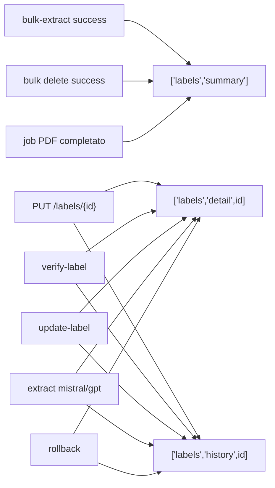

# Documentazione — Sezione Etichette — Part 4

[Back to the guide index](../LABEL_DOCS.md)

|                 |                                             |
| --------------- | ------------------------------------------- |
| **Endpoint**    | `POST /labels/verify-label/{id}`            |
| **File FE**     | `src/api/labels.ts` → `verifyLabel()`       |
| **Chiamato da** | Checkbox "Verificata" in `Label/Detail.tsx` |

```bash
curl -X POST "$BASE_URL/labels/verify-label/LABEL_UUID" \
  -H "Content-Type: application/json" \
  -H "Accept: application/json" \
  --cookie "$COOKIE" \
  -d '{ "isVerified": true }'
```

---

### 10. Re-extract from stored raw text

|                 |                                                            |
| --------------- | ---------------------------------------------------------- |
| **Endpoint**    | `POST /labels/update-label/{id}`                           |
| **File FE**     | `src/api/labels.ts` → `updateLabelOverwrite()`             |
| **Chiamato da** | Pulsante "Aggiorna" in `Label/Detail.tsx` (`confirmAsync`) |

```bash
curl -X POST "$BASE_URL/labels/update-label/LABEL_UUID" \
  -H "Accept: application/json" \
  --cookie "$COOKIE"
```

Empty body. This endpoint does not fetch SIAN again: it re-runs structured
extraction on the `rawText` already stored in `LabelExtraction`.

### 10 bis. Queue ministerial source refresh

|              |                                              |
| ------------ | -------------------------------------------- |
| **Endpoint** | `POST /labels/{id}/refresh`                  |
| **Access**   | `ADMIN` or `LABEL_MANAGER`                   |
| **Behavior** | Queues `LabelRefreshQueue` with `mode="ids"` |

```bash
curl -X POST "$BASE_URL/labels/LABEL_UUID/refresh" \
  -H "Accept: application/json" \
  --cookie "$COOKIE"
```

The async worker fetches the current SIAN PDF, compares PDF/text hashes,
re-extracts only when content changed, writes system history, and updates
product label summaries.

Internal cron endpoint:

```http
POST /internal/labels/refresh
Header: X-Cron-Secret: <LABEL_REFRESH_CRON_SECRET>
Body: { "mode": "stale", "limit": 50, "dryRun": false }
```

Cloud Scheduler setup:

```bash
PROJECT_ID="<project-id>" \
LABEL_REFRESH_CRON_SECRET="<strong-secret>" \
scripts/gcloud/create-label-refresh-scheduler.sh
```

---

### 11. Re-estrazione con Mistral

|                 |                                              |
| --------------- | -------------------------------------------- |
| **Endpoint**    | `POST /labels/extract-with-mistral/{id}`     |
| **File FE**     | `src/api/labels.ts` → `extractWithMistral()` |
| **Chiamato da** | Drawer "Estratto" in `Label/Detail.tsx`      |

```bash
curl -X POST "$BASE_URL/labels/extract-with-mistral/LABEL_UUID" \
  -H "Accept: application/json" \
  --cookie "$COOKIE"
```

---

### 12. Re-estrazione con GPT

|                 |                                          |
| --------------- | ---------------------------------------- |
| **Endpoint**    | `POST /labels/extract-with-gpt/{id}`     |
| **File FE**     | `src/api/labels.ts` → `extractWithGpt()` |
| **Chiamato da** | Drawer "Estratto" in `Label/Detail.tsx`  |

```bash
curl -X POST "$BASE_URL/labels/extract-with-gpt/LABEL_UUID" \
  -H "Content-Type: application/json" \
  -H "Accept: application/json" \
  --cookie "$COOKIE"
```

---

### 13. Cronologia modifiche

|                 |                                                    |
| --------------- | -------------------------------------------------- |
| **Endpoint**    | `GET /labels/{labelExtractionId}/history`          |
| **File FE**     | `src/api/labels.ts` → `getLabelHistory()`          |
| **Chiamato da** | `useLabelHistory` (drawer "Cronologia", lazy load) |

```bash
curl "$BASE_URL/labels/LABEL_UUID/history" \
  -H "Accept: application/json" \
  --cookie "$COOKIE"
```

**Risposta:**

```json
{
  "status": "success",
  "data": [
    {
      "id": "history-uuid",
      "labelExtractionId": "label-uuid",
      "userId": "user-uuid",
      "userName": "Mario Rossi",
      "userProfilePictureUrl": null,
      "changes": [{ "field": "label.dosaggi_dettagliati", "oldValue": [], "newValue": [{}] }],
      "previousSnapshot": {},
      "createdAt": "2025-06-06T12:00:00.000Z"
    }
  ]
}
```

---

### 14. Rollback cronologia

|                 |                                                        |
| --------------- | ------------------------------------------------------ |
| **Endpoint**    | `POST /labels/rollback/{historyId}`                    |
| **File FE**     | `src/api/labels.ts` → `rollbackLabel()`                |
| **Chiamato da** | Drawer "Cronologia" in `Label/Detail.tsx` (solo ADMIN) |

```bash
curl -X POST "$BASE_URL/labels/rollback/HISTORY_UUID" \
  -H "Accept: application/json" \
  --cookie "$COOKIE"
```

---

### 15. Lookup etichetta per prodotto (non usato in UI)

|              |                                                                        |
| ------------ | ---------------------------------------------------------------------- |
| **Endpoint** | `GET /labels/by-product?name=…&regNumber=…`                            |
| **File FE**  | `src/api/product-labels.ts` → `productLabelsApiService.getByProduct()` |
| **Stato**    | API definita ma **non collegata a nessuna pagina** del frontend        |

```bash
curl -G "$BASE_URL/labels/by-product" \
  --data-urlencode "name=REVOLUTION" \
  --data-urlencode "regNumber=16667" \
  -H "Accept: application/json" \
  -H "Authorization: Bearer $TOKEN" \
  --cookie "$COOKIE"
```

404 → il client restituisce `{ status: "success", data: null }`.

---

### Riepilogo endpoint

| #   | Endpoint                                  | Metodo | Client HTTP                           |
| --- | ----------------------------------------- | ------ | ------------------------------------- |
| 1   | `/labels/summary`                         | GET    | `fetch` + cookie                      |
| 2   | `/labels/{id}`                            | GET    | `fetch` + cookie                      |
| 3   | `/labels/bulk-extract`                    | POST   | `fetch` + cookie                      |
| 4   | `/labels/bulk-pdf-label-async`            | POST   | `authenticatedHttpClient`             |
| 5   | `/labels/bulk-pdf-label-fertilizer-async` | POST   | `authenticatedHttpClient`             |
| 6   | `/labels/job-status/{jobId}`              | GET    | `authenticatedHttpClient`             |
| 7   | `/labels/bulk`                            | DELETE | `fetch` + cookie                      |
| 8   | `/labels/{id}`                            | PUT    | `fetch` + cookie                      |
| 9   | `/labels/verify-label/{id}`               | POST   | `fetch` + cookie                      |
| 10  | `/labels/update-label/{id}`               | POST   | `fetch` + cookie                      |
| 11  | `/labels/{id}/refresh`                    | POST   | `fetch` + cookie                      |
| 12  | `/internal/labels/refresh`                | POST   | Cloud Scheduler + `X-Cron-Secret`     |
| 13  | `/labels/extract-with-mistral/{id}`       | POST   | `fetch` + cookie                      |
| 14  | `/labels/extract-with-gpt/{id}`           | POST   | `fetch` + cookie                      |
| 15  | `/labels/{id}/history`                    | GET    | `fetch` + cookie                      |
| 16  | `/labels/rollback/{historyId}`            | POST   | `fetch` + cookie                      |
| 17  | `/labels/by-product`                      | GET    | `authenticatedHttpClient` (non usato) |

---

## 7. TanStack Query — cache e invalidazioni

### Query keys

| Query key                                  | Hook / pagina                         | API sottostante            |
| ------------------------------------------ | ------------------------------------- | -------------------------- |
| `["labels", "summary"]`                    | `useLabelsSummary`, `Label/index.tsx` | `GET /labels/summary`      |
| `["labels", "detail", id]`                 | `useLabel`                            | `GET /labels/{id}`         |
| `["labels", "history", labelExtractionId]` | `useLabelHistory`                     | `GET /labels/{id}/history` |

### Invalidazioni



| Azione                                            | Query invalidate                                        |
| ------------------------------------------------- | ------------------------------------------------------- |
| `bulk-extract` (manuale)                          | `["labels", "summary"]`                                 |
| `bulk delete`                                     | `["labels", "summary"]`                                 |
| Job PDF completato                                | `["labels", "summary"]`                                 |
| `saveAsync` (PUT)                                 | `["labels", "detail", id]`, `["labels", "history", id]` |
| `verifyAsync`                                     | `["labels", "detail", id]`, `["labels", "history", id]` |
| `confirmAsync` (Aggiorna)                         | `["labels", "detail", id]`, `["labels", "history", id]` |
| `extractWithMistralAsync` / `extractWithGptAsync` | `["labels", "detail", id]`, `["labels", "history", id]` |
| `rollbackAsync`                                   | `["labels", "detail", id]`, `["labels", "history", id]` |

La cronologia usa `enabled: Boolean(labelExtractionId) && enabled` — viene caricata solo quando il drawer è aperto.

---

## 8. Integrazioni correlate

### Job view (`src/routes/Job/index.tsx`)

- Usa `useLabelsSummary()` per ottenere l'elenco etichette
- Match client-side tra operazioni e etichette per `productName` / `registrationNumber`
- Apre un sheet laterale read-only (`LabelDetailSheet`) con ricerca testuale sui campi
- Riutilizza `useLabel` per caricare il dettaglio completo

### Dosage Agent Chat (`src/routes/DosageAgentChat/constants.ts`)
